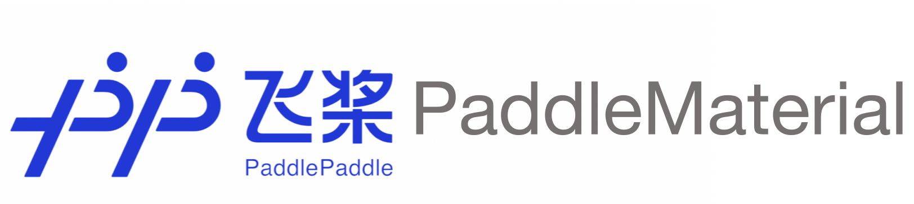

# PaddleMaterial

<p align="center">
 
<p align="center">

## 🚀 Introduction

**PaddleMaterial** is a data-driven deep learning toolkit based on PaddlePaddle for material science, designed to help researchers more efficiently explore, discover, and develop new materials. It has supported crystalline materials and will support more types of materials including polymers, organic molecules, catalysts, and so on. It has supported the equivalent graph networks-based model and will support the language-based model and multi-modal model in the feature.

**Crystalline materials**, characterized by their symmetrical and periodic structures, exhibit a wide range of properties and are widely applied in various fields, from electronic devices to energy applications. Traditional experimental and computational methods for discovering crystalline materials are often time-consuming and expensive. Data-driven approaches to material discovery have the power to model the highly complex atomic systems within crystalline materials, paving the way for rapid and accurate material discovery.


## 📑 Task
- [MLIP-Machine Learning Interatomic Potential](interatomic_potentials/README.md)
- [IOMPP-Inorganic Material Property Prediction](property_prediction/README.md)
- [IOMSG-Inorganic Material Structure Generation](structure_generation/README.md)

## 🔧 Installation

Please refer to the installation [document](Install.md) for environment configuration.


## ⚡ Get Started

PaddleMaterial offers multiple built-in models that can be directly used for inference. Taking the `megnet_mp2018_train_60k_e_form` model as an example (a MEGNet model trained on the MP2018 dataset for material formation energy prediction), use the following command for inference:
```bash
python property_prediction/predict.py --model_name='megnet_mp2018_train_60k_e_form' --weights_name='best.pdparams' --cif_file_path='./property_prediction/example_data/cifs/' --save_path='result.csv'
```

<table>
    <thead>
        <tr>
            <th>Parameter</th>
            <th>Description</th>
        </tr>
    </thead>
    <tbody>
        <tr>
            <td>--model_name</td>
            <td>Name of the built-in model</td>
        </tr>
        <tr>
            <td>--weights_name</td>
            <td>Weights file name</td>
        </tr>
        <tr>
            <td>--cif_file_path</td>
            <td>Path to CIF files for prediction</td>
        </tr>
        <tr>
            <td>--save_path</td>
            <td>Path to save prediction results</td>
        </tr>
    </tbody>
</table>

For more information on how to use PaddleMaterial to train and fine tune a model, please refer to the [documentation](get_started.md).


## 👩‍👩‍👧‍👦 Cooperative Partner


## 🔄 Feedback

We sincerely invite you to spare a moment from your busy schedule to share your [feedback](https://paddle.wjx.cn/vm/rXyQwB2.aspx#).


## 📜 License

PaddleMaterial is licensed under the [Apache License 2.0](LICENSE).


## 🎓 Citation


    @misc{paddlematerial2025,
    title={PaddleMaterial, a deep learning toolkit based on PaddlePaddle for material science.},
    author={PaddleMaterial Contributors},
    howpublished = {\url{https://github.com/PaddlePaddle/PaddleMaterial}},
    year={2025}
    }


## Acknowledgements

This repository references the code from the following repositories:
[PaddleScience](https://github.com/PaddlePaddle/PaddleScience),
[Matgl](https://github.com/materialsvirtuallab/matgl),
[CDVAE](https://github.com/txie-93/cdvae),
[DiffCSP](https://github.com/jiaor17/DiffCSP),
[MatterGen](https://github.com/microsoft/mattergen),
[MatterSim](https://github.com/microsoft/mattersim),
[CHGNet](https://github.com/CederGroupHub/chgnet),
[AIRS](https://github.com/divelab/AIRS),
etc.
