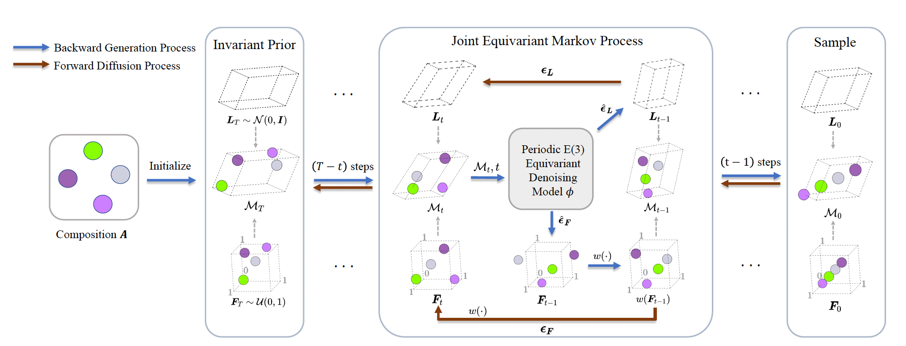
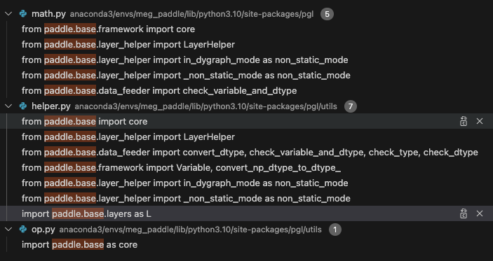

# PaddleScience-Material

 

## 概述

在一个维度上材料尺寸减小到极限的原子层厚度, 而在其他两个维度,材料尺寸相对较大。x，y方向上存在周期性。
基于图神经网络和扩散模型，从公开已有的2万条的二维材料数据库，扩展到几十万，百万规模。

已整理好的数据、模型可从[此处](https://pan.baidu.com/s/1payB2J7uJE8nOSa_wVSHLw?pwd=13k6)下载。

1. [基于GNN的二维材料稳定性预测](stability_prediction/README.md)

    

        
    

2. [基于扩散模型的二维材料结构生成](structure_prediction/README.md)

    

        
    

## 环境安装
#### 依赖环境：
    python==3.10.9
    paddlepaddle==2.6.1
    pgl==2.2.3
    pymatgen==2024.6.10

#### 新建环境：
    conda create -n test_env python=3.10.9
    conda activate test_env

#### 安装所需依赖包：
    pip install -r requirments.txt

由于PGL暂不兼容最新版本的Paddle，因此安装完成PGL后需要在安装路径内修改部分代码：
例如我的安装路径为：anaconda3/envs/meg_paddle/lib/python3.10/site-packages/pgl

1. 代码fluid替换为base:

    a. 将pgl下所有文件中的 paddle.fluid 替换为 paddle.base

    b. 将 paddle.base.core as core 替换为 paddle.base as core

    该部分会涉及到3个文件的改动，修改后如下：
    

2. 删除"overwrite"参数：
    在pgl/utils/helper.py中，将第109行 'overwrite' 参数删除，如下所示：

        if non_static_mode():
        # return _C_ops.scatter(x, index, updates, 'overwrite', overwrite)
        return _C_ops.scatter(x, index, updates, overwrite)
