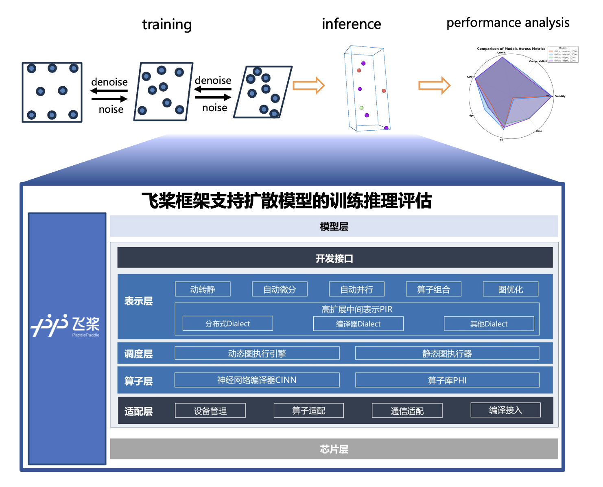

# PaddleScience-Material

 

## Introduction

**PaddleScience-Material** is a data-driven deep learning toolkit based on PaddlePaddle for material science, designed to help researchers more efficiently explore, discover, and develop new materials. It has supported crystalline materials and will support more types of materials including polymers, organic molecules, catalysts, and so on. It has supported the equivalent graph networks-based model and will support the language-based model and multi-modal model in the feature.

**Crystalline materials**, characterized by their symmetrical and periodic structures, exhibit a wide range of properties and are widely applied in various fields, from electronic devices to energy applications. Traditional experimental and computational methods for discovering crystalline materials are often time-consuming and expensive. Data-driven approaches to material discovery have the power to model the highly complex atomic systems within crystalline materials, paving the way for rapid and accurate material discovery.

Pre-processed datasets and models are available for download [here](https://pan.baidu.com/s/1payB2J7uJE8nOSa_wVSHLw?pwd=13k6).

## 1. Property prediction

[GNN-Based Prediction of 2D Material Stability](stability_prediction/README.md)

    

### Results

#### Datasets:

- MP2018.6.1

    The original dataset can download from [here](https://figshare.com/ndownloader/files/15087992).
    For the convenience of training, we divided it into a ratio of 0.9:0.05:0.05，you can download it from [here](https://pan.baidu.com/s/1Y6ye2hu3y0v9ofDs06tejg?pwd=n3my)

    |  Dataset   | train |  val  | test  |
    | :--------: | :---: | :---: | :---: |
    | MP2018.6.1 | 62315 | 3461  | 3463  |

- MP20
    The MP20 dataset can download from [here](https://github.com/jiaor17/DiffCSP/tree/main/data/mp_20).

    | Dataset | train |  val  | test  |
    | :-----: | :---: | :---: | :---: |
    |  MP20   | 27136 | 9047  | 9046  |

#### Task 1: formation energy per atom

|   Model   | Dataset | MAE(test dataset) |                            config                             |                               Checkpoint                               |
| :-------: | :-----: | :---------------: | :-----------------------------------------------------------: | :--------------------------------------------------------------------: |
|  MegNet   |  MP18   |       0.034       |  [megnet_mp18](property_prediction/configs/megnet_mp18.yaml)  | [checkpoint](https://pan.baidu.com/s/128VPZFjBmhObyJSkoCxUxA?pwd=kv82) |
| DimeNet++ |  MP18   |       0.030       | [dimenet_mp18](property_prediction/configs/dimenet_mp18.yaml) | [checkpoint](https://pan.baidu.com/s/1QdafA1DSQ9yj9UzgXTNmiA?pwd=ke3x) |
|  MegNet   |  MP20   |       0.028       |  [megnet_mp20](property_prediction/configs/megnet_mp20.yaml)  | [checkpoint](https://pan.baidu.com/s/15BRj5_-N1yw767vldm8qFg?pwd=bmat) |
| DimeNet++ |  MP20   |       0.023       | [dimenet_mp20](property_prediction/configs/dimenet_mp20.yaml) | [checkpoint](https://pan.baidu.com/s/17SkyrvOOsoSgdsWAr3fwIA?pwd=bnnn) |
|  GemNet   |  MP20   |       0.023       |  [gemnet_mp20](property_prediction/configs/gemnet_mp20.yaml)  | [checkpoint](https://pan.baidu.com/s/1MWkFZ9xkyTfinf8pwt5SxA?pwd=8k68) |

#### Task 2: Band Gap

<table>
    <head>
        <tr>
            <th  nowrap="nowrap">Model</th>
            <th  nowrap="nowrap">Dataset</th>
            <th  nowrap="nowrap">MAE (test dataset)</th>
            <th  nowrap="nowrap">Config</th>
            <th  nowrap="nowrap">Checkpoint</th>
        </tr>
    </head>
    <body>
        <tr>
            <td  nowrap="nowrap">MegNet</td>
            <td  nowrap="nowrap">MP18</td>
            <td  nowrap="nowrap">0.315</td>
            <td  nowrap="nowrap"><a href="./property_prediction/configs/megnet_mp18_band_gap.yaml">megnet_mp18_band_gap</a></td>
            <td  nowrap="nowrap"><a href="https://pan.baidu.com/s/1h8I8-d1kDqXDSNyCsE5_Eg?pwd=3man">checkpoint</a></td>
        </tr>
    </body>
</table>

##### Training:

    # single GPU
    PYTHONPATH=$PWD python property_prediction/train.py -c property_prediction/configs/your_config.yaml

    # multi GPU, such as 2 GPUs
    PYTHONPATH=$PWD python -m paddle.distributed.launch --gpus="0,1" property_prediction/train.py -c property_prediction/configs/your_config.yaml

##### Testing:

    PYTHONPATH=$PWD python property_prediction/train.py -c property_prediction/configs/your_config.yaml --mode=test Global.pretrained_model_path="your model path(.pdparams)"

##### Prediction:

    PYTHONPATH=$PWD python property_prediction/predict.py -c property_prediction/configs/your_config.yaml  Global.pretrained_model_path="your model path(.pdparams)"

## 2. Structure prediction

[Diffusion Model-Based Generation of 2D Material Structures](structure_prediction/README.md)

    

### Results

#### Task 1: Stable Structure Prediction

<table>
    <head>
        <tr>
            <th  nowrap="nowrap">Model</th>
            <th  nowrap="nowrap"># of samples</th>
            <th  nowrap="nowrap">Dataset</th>
            <th  nowrap="nowrap">Match rate</th>
            <th  nowrap="nowrap">RMSE</th>
            <th  nowrap="nowrap">Config</th>
            <th  nowrap="nowrap">Checkpoint</th>
        </tr>
    </head>
    <body>
        <tr>
            <td  nowrap="nowrap">diffcsp</td>
            <td  nowrap="nowrap">1</td>
            <td  nowrap="nowrap">mp_20</td>
            <td  nowrap="nowrap">53.47</td>
            <td  nowrap="nowrap">0.0540</td>
            <td  nowrap="nowrap"><a href="./structure_generation/configs/diffcsp_mp20.yaml">diffcsp_mp20</a></td>
            <td  nowrap="nowrap"><a href="https://pan.baidu.com/s/1Sqv_qL2A9tvycfMv6P-rEw?pwd=4kk7">checkpoint</a></td>
        </tr>
    </body>
</table>

#### Task 2: Ab Initio Crystal Generation

<table>
    <head>
        <tr>
            <th  nowrap="nowrap">Model</th>
            <th  nowrap="nowrap">Dataset</th>
            <th  nowrap="nowrap">samples</th>
            <th  nowrap="nowrap">Validity Struc. / Comp.</th>
            <th  nowrap="nowrap">COV R / P</th>
            <th  nowrap="nowrap"><i>d&#x3C1</i></th>
            <th  nowrap="nowrap"><i>dE</i></th>
            <th  nowrap="nowrap"><i>dele</i></th>
            <th  nowrap="nowrap">Config</th>
            <th  nowrap="nowrap">Checkpoint</th>
        </tr>
    </head>
    <body>
        <tr>
            <td  nowrap="nowrap">diffcsp(one-hot)</td>
            <td  nowrap="nowrap">mp_20</td>
            <td  nowrap="nowrap">1000</td>
            <td  nowrap="nowrap">99.94/84.18</td>
            <td  nowrap="nowrap">99.51/99.33</td>
            <td  nowrap="nowrap">0.1808</td>
            <td  nowrap="nowrap">0.1282</td>
            <td  nowrap="nowrap">0.5039</td>
            <td  nowrap="nowrap"><a href="./structure_generation/configs/diffcsp_mp20_with_type.yaml">diffcsp_mp20_with_type</a></td>
            <td  nowrap="nowrap"><a href="https://pan.baidu.com/s/10Em9kiOTPFffoP7vfGf_Dg?pwd=mghq">checkpoint</a></td>
        </tr>
        <tr>
            <td  nowrap="nowrap">diffcsp(one-hot)</td>
            <td  nowrap="nowrap">mp_20</td>
            <td  nowrap="nowrap">5000</td>
            <td  nowrap="nowrap">99.94/84.18</td>
            <td  nowrap="nowrap">99.51/99.33</td>
            <td  nowrap="nowrap">0.1802</td>
            <td  nowrap="nowrap">0.1182</td>
            <td  nowrap="nowrap">0.5119</td>
            <td  nowrap="nowrap"><a href="./structure_generation/configs/diffcsp_mp20_with_type.yaml">diffcsp_mp20_with_type</a></td>
            <td  nowrap="nowrap"><a href="https://pan.baidu.com/s/10Em9kiOTPFffoP7vfGf_Dg?pwd=mghq">checkpoint</a></td>
        </tr>
        <tr>
            <td  nowrap="nowrap">diffcsp(d3pm-uniform)</td>
            <td  nowrap="nowrap">mp_20</td>
            <td  nowrap="nowrap">1000</td>
            <td  nowrap="nowrap">99.89/82.54</td>
            <td  nowrap="nowrap">99.67/99.66</td>
            <td  nowrap="nowrap">0.1354</td>
            <td  nowrap="nowrap">0.1107</td>
            <td  nowrap="nowrap">0.0870</td>
            <td  nowrap="nowrap"><a href="./structure_generation/configs/diffcsp_mp20_d3pm_uniform.yaml">diffcsp_mp20_d3pm_uniform</a></td>
            <td  nowrap="nowrap"><a href="https://pan.baidu.com/s/1DDi196dl3BNFdDWjhCR9CQ?pwd=9f9w">checkpoint</a></td>
        </tr>
        <tr>
            <td  nowrap="nowrap">diffcsp(d3pm-uniform)</td>
            <td  nowrap="nowrap">mp_20</td>
            <td  nowrap="nowrap">5000</td>
            <td  nowrap="nowrap">99.89/82.54</td>
            <td  nowrap="nowrap">99.67/99.66</td>
            <td  nowrap="nowrap">0.0714</td>
            <td  nowrap="nowrap">0.0851</td>
            <td  nowrap="nowrap">0.1156</td>
            <td  nowrap="nowrap"><a href="./structure_generation/configs/diffcsp_mp20_d3pm_uniform.yaml">diffcsp_mp20_d3pm_uniform</a></td>
            <td  nowrap="nowrap"><a href="https://pan.baidu.com/s/1DDi196dl3BNFdDWjhCR9CQ?pwd=9f9w">checkpoint</a></td>
        </tr>
        <tr>
            <td  nowrap="nowrap">diffcsp(d3pm-absorbing)</td>
            <td  nowrap="nowrap">mp_20</td>
            <td  nowrap="nowrap">1000</td>
            <td  nowrap="nowrap">99.89/82.54</td>
            <td  nowrap="nowrap">99.59/99.66</td>
            <td  nowrap="nowrap">0.1302</td>
            <td  nowrap="nowrap">0.0349</td>
            <td  nowrap="nowrap">0.0760</td>
            <td  nowrap="nowrap"><a href="./structure_generation/configs/diffcsp_mp20_d3pm_absorbing.yaml">diffcsp_mp20_d3pm_absorbing</a></td>
            <td  nowrap="nowrap"><a href="https://pan.baidu.com/s/1kP14XO-VW7tKgeFtClonUg?pwd=38w9">checkpoint</a></td>
        </tr>
        <tr>
            <td  nowrap="nowrap">diffcsp(d3pm-absorbing)</td>
            <td  nowrap="nowrap">mp_20</td>
            <td  nowrap="nowrap">5000</td>
            <td  nowrap="nowrap">99.89/82.54</td>
            <td  nowrap="nowrap">99.59/99.66</td>
            <td  nowrap="nowrap">0.1176</td>
            <td  nowrap="nowrap">0.0395</td>
            <td  nowrap="nowrap">0.1116</td>
            <td  nowrap="nowrap"><a href="./structure_generation/configs/diffcsp_mp20_d3pm_absorbing.yaml">diffcsp_mp20_d3pm_absorbing</a></td>
            <td  nowrap="nowrap"><a href="https://pan.baidu.com/s/1kP14XO-VW7tKgeFtClonUg?pwd=38w9">checkpoint</a></td>
        </tr>
    </body>
</table>

##### Training:

    # single GPU
    PYTHONPATH=$PWD python structure_generation/train.py -c structure_generation/configs/your_config.yaml

    # multi GPU, such as 2 GPUs
    PYTHONPATH=$PWD python -m paddle.distributed.launch --gpus="0,1" structure_generation/train.py -c structure_generation/configs/your_config.yaml

##### Testing:

    PYTHONPATH=$PWD python structure_generation/train.py -c structure_generation/configs/your_config.yaml --mode=test  Global.pretrained_model_path="your model path(.pdparams)"

##### Prediction:

    PYTHONPATH=$PWD python structure_generation/predict.py -c structure_generation/configs/your_config.yaml  Global.pretrained_model_path="your model path(.pdparams)"

#### Task 2: Ab Initio Crystal Generation-legacy

|                       Model                       | Dataset | samples | Validity Struc. / Comp. | COV R / P  | $d_\rho$ | $d_E$  | $d_{ele}$ |                                            Config                                            |                               Checkpoint                               |
| :-----------------------------------------------: | :-----: | :-----: | :------------------------: | :-----------: | :------: | :----: | :-------: | :------------------------------------------------------------------------------------------: | :--------------------------------------------------------------------: |
| [diffcsp-paper](https://arxiv.org/abs/2309.04475) |  mp_20  |  1000   |        100 / 83.25         | 99.71 / 99.76 |  0.3502  | 0.1247 |  0.3398   |                                              -                                               |                                   -                                    |
|               diffcsp (one-hot)                |  mp_20  |  1000   |       99.95 / 84.51        | 99.61 / 99.32 |  0.2069  | 0.0659 |  0.4193   |      [diffcsp_mp20_with_type](structure_prediction/configs/diffcsp_mp20_with_type.yaml)      | [checkpoint](https://pan.baidu.com/s/1JiniNkRb2Rb_sGNhrKpU_w?pwd=1ath) |
|               diffcsp (one-hot)                |  mp_20  |  5000   |       99.95 / 84.51        | 99.61 / 99.32 |  0.1170  | 0.0723 |  0.3988   |      [diffcsp_mp20_with_type](structure_prediction/configs/diffcsp_mp20_with_type.yaml)      | [checkpoint](https://pan.baidu.com/s/1JiniNkRb2Rb_sGNhrKpU_w?pwd=1ath) |
|             diffcsp (d3pm-uniform)             |  mp_20  |  1000   |       99.95 / 82.19        | 99.51 / 99.73 |  0.1582  | 0.1292 |  0.1360   |           [diffcsp_mp20_d3pm](structure_prediction/configs/diffcsp_mp20_d3pm.yaml)           | [checkpoint](https://pan.baidu.com/s/1qU8TDMAhrrkp12zMuXg6VA?pwd=2jcc) |
|             diffcsp (d3pm-uniform)             |  mp_20  |  5000   |       99.95 / 82.19        | 99.51 / 99.73 |  0.1651  | 0.0939 |  0.1310   |           [diffcsp_mp20_d3pm](structure_prediction/configs/diffcsp_mp20_d3pm.yaml)           | [checkpoint](https://pan.baidu.com/s/1qU8TDMAhrrkp12zMuXg6VA?pwd=2jcc) |
|            diffcsp (d3pm-absorbing)            |  mp_20  |  1000   |       99.89 / 82.66        | 99.91 / 99.47 |  0.2093  | 0.1186 |  0.1460   | [diffcsp_mp20_d3pm_absorbing](structure_prediction/configs/diffcsp_mp20_d3pm_absorbing.yaml) | [checkpoint](https://pan.baidu.com/s/1HbIrhvjLNk83aIon8Pz_5Q?pwd=815m) |
|            diffcsp (d3pm-absorbing)            |  mp_20  |  5000   |       99.89 / 82.66        | 99.91 / 99.47 |  0.1809  | 0.0988 |  0.1262   | [diffcsp_mp20_d3pm_absorbing](structure_prediction/configs/diffcsp_mp20_d3pm_absorbing.yaml) | [checkpoint](https://pan.baidu.com/s/1HbIrhvjLNk83aIon8Pz_5Q?pwd=815m) |
|            mattergen (d3pm-uniform)            |  mp_20  |  5000   |       99.95 / 84.78        | 99.75 / 99.37 |  0.8866  | 0.0843 |  0.9575   |              [mattergen_mp20](structure_prediction/configs/mattergen_mp20.yaml)              | [checkpoint](https://pan.baidu.com/s/1yv_4YNi2vQtOnoP1ZpG87w?pwd=u77b) |

The term "samples" refers to the valid samples of generated structures utilized for calculating $d_\rho$, $d_E$  and  $d_{ele}$.

# Install

Please refer to the installation [document](install.md) for environment configuration.

# Acknowledgements

This repo referenced the code of the following repos: [PaddleScience](https://github.com/PaddlePaddle/PaddleScience), [Matgl](https://github.com/materialsvirtuallab/matgl), [CDVAE](https://github.com/txie-93/cdvae), [DiffCSP](https://github.com/jiaor17/DiffCSP)
