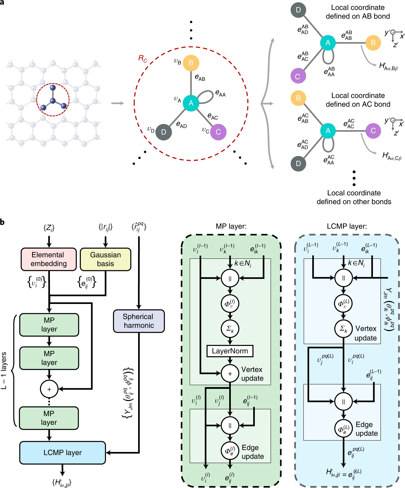

# DeepH

[Deep-learning density functional theory Hamiltonian for efficient ab initio electronic-structure calculation](https://www.nature.com/articles/s43588-022-00265-6)

## Introduction

DeepH learns density functional theory (DFT) Hamiltonian matrix elements from
crystal structures. By combining locality of electronic interactions with graph
neural network message passing, the model predicts Hamiltonian blocks on
periodic atom-pair edges and enables efficient downstream electronic-structure
calculation without repeatedly running expensive self-consistent DFT.



Figure source: [Nature Computational Science, Fig. 2](https://www.nature.com/articles/s43588-022-00265-6/figures/2).

## Model

DeepH represents a crystal as a periodic graph. Nodes are atoms, edges are atom
pairs within a cutoff radius, and each edge corresponds to a Hamiltonian block
$H_{ij}$ between local atomic orbitals. The PaddleMaterials integration reuses
the suite graph converter to build the periodic crystal graph and keeps the
DeepH-specific LCMP subgraph features for angular message passing.

For an edge $(i, j)$, the target is the selected orbital entry or block of
$H_{ij}$. Edge distances are expanded by Gaussian radial bases, angular
features are generated from spherical harmonics in local frames, and stacked
message-passing layers update atom/edge representations. A final edge decoder
predicts Hamiltonian entries with a masked mean-squared-error objective:

$$
\mathcal{L} =
\frac{\sum_{(i,j),k} M_{ij,k}(\hat{H}_{ij,k}-H_{ij,k})^2}
{\sum_{(i,j),k} M_{ij,k}}.
$$

The training config validates the non-spin graphene Hamiltonian path with
`interface=npz`, `target=hamiltonian`, and `if_lcmp_graph=True`. Both
radius-based graphs (`create_from_DFT=False`) and DFT matrix sparsity graphs
(`create_from_DFT=True`) are supported. Label-free inference uses
`interface=npz_rc_only` with local coordinates generated from OpenMX overlap
blocks.

## Datasets

The graphene example uses DeepH processed data. Each structure folder contains
the crystal geometry and Hamiltonian labels:

```text
lat.dat
site_positions.dat
element.dat
orbital_types.dat
rh.npz
rc.npz
```

The PaddleMaterials dataset adapter:

- reads DeepH processed folders from `raw_dir`;
- reconstructs canonical `pymatgen.Structure` objects with `BuildStructure`;
- builds periodic crystal graphs with `FindPointsInSpheres`;
- attaches DeepH Hamiltonian labels and LCMP subgraph metadata;
- caches parsed graph samples under the configured `graph_dir`.

The dataset was released with the
[official DeepH-pack project](https://github.com/mzjb/DeepH-pack). Its processed
format stores crystal geometry, local-coordinate matrices, and DFT Hamiltonian
blocks for each structure. The train/validation/test split is generated with a
fixed random seed from the ratios below.

The baseline graphene split follows the original DeepH config ratios:

| Dataset | Train | Val | Test | Seed |
| --- | ---: | ---: | ---: | ---: |
| graphene | 60% | 20% | 20% | 42 |

Download the graphene dataset, pretrained checkpoint, and logs from
[deeph_bce_handoff](https://pan.baidu.com/s/1dkXlzYV_3DLQugoQDKjsbA?pwd=vi6r)
(password: `vi6r`).

## Results

<table>
    <thead>
        <tr>
            <th nowrap="nowrap">Model Name</th>
            <th nowrap="nowrap">Dataset</th>
            <th nowrap="nowrap">Forward max diff</th>
            <th nowrap="nowrap">Train align diff</th>
            <th nowrap="nowrap">Test loss</th>
            <th nowrap="nowrap">Compiler speedup</th>
            <th nowrap="nowrap">Config</th>
            <th nowrap="nowrap">Checkpoint | Log</th>
        </tr>
    </thead>
    <tbody>
        <tr>
            <td nowrap="nowrap">deeph_graphene</td>
            <td nowrap="nowrap">graphene</td>
            <td nowrap="nowrap">1.1444e-05</td>
            <td nowrap="nowrap">4.0531e-06</td>
            <td nowrap="nowrap">0.01072441</td>
            <td nowrap="nowrap">88.9434%</td>
            <td nowrap="nowrap"><a href="deeph_graphene.yaml">deeph_graphene</a></td>
            <td nowrap="nowrap"><a href="https://pan.baidu.com/s/1dkXlzYV_3DLQugoQDKjsbA?pwd=vi6r">deeph_bce_handoff</a> (pwd: vi6r)</td>
        </tr>
        <tr>
            <td nowrap="nowrap">deeph_tbg_subset</td>
            <td nowrap="nowrap">TBG_subset</td>
            <td nowrap="nowrap">1.3351e-05</td>
            <td nowrap="nowrap">1.6809e-05</td>
            <td nowrap="nowrap">-</td>
            <td nowrap="nowrap">-</td>
            <td nowrap="nowrap">-</td>
            <td nowrap="nowrap">alignment evidence</td>
        </tr>
    </tbody>
</table>

**Metric notes:** `Train align diff` reports the step-1 loss difference against
the original DeepH reference implementation. The graphene supervised metric
alignment has absolute `test_loss` difference `1.0801e-04`. Compiler speedup is
measured by comparing Paddle dynamic evaluation latency (`21.6952 ms`) with
`to_static`/CINN evaluation latency (`11.4824 ms`).

## Command

### Training

```bash
python electronic_structure/train.py \
  -c electronic_structure/configs/deeph/deeph_graphene.yaml
```

### Validation

```bash
python electronic_structure/train.py \
  -c electronic_structure/configs/deeph/deeph_graphene.yaml \
  Global.do_train=False Global.do_eval=True Global.do_test=False \
  Trainer.pretrained_model_path='data/deeph/graphene/best.pdparams'
```

### Testing

```bash
python electronic_structure/train.py \
  -c electronic_structure/configs/deeph/deeph_graphene.yaml \
  Global.do_train=False Global.do_eval=False Global.do_test=True \
  Trainer.pretrained_model_path='data/deeph/graphene/best.pdparams'
```

### Dynamic-to-static / CINN evaluation

```bash
FLAGS_use_cinn=1 python electronic_structure/train.py \
  -c electronic_structure/configs/deeph/deeph_graphene.yaml \
  Global.do_train=False Global.do_eval=True Global.do_test=False \
  Trainer.pretrained_model_path='data/deeph/graphene/best.pdparams'
```

### OpenMX DFT inference

DeepH inference first runs the overlap-only OpenMX calculation through ASE,
parses its sparse overlap blocks, constructs the LCMP graph, runs the Paddle
checkpoint, and writes the predicted Hamiltonian. Configure the external DFT
software before launching ppmatSim:

```bash
export OPENMX_DFT_DATA_PATH=/path/to/DFT_DATA19

python ppmatSim/main.py --config-name deeph_openmx \
  Model.config_path=electronic_structure/configs/deeph/deeph_graphene.yaml \
  Model.checkpoint_path=data/deeph/graphene/best.pdparams \
  Calculator.command='mpirun -np 4 /path/to/openmx_overlap' \
  System.file_path=/path/to/inference_cifs
```

For each input structure, the workflow saves the raw OpenMX calculation,
processed geometry, `overlaps.npz`, `rc.npz`, and the predicted `rh_pred.npz`
under `deeph_dft_results/<sample_id>/`. The supplied graphene model supports
carbon structures with the OpenMX `C6.0-s2p2d1` basis.

## Citation

```bibtex
@article{li2022deeph,
  title={Deep-learning density functional theory Hamiltonian for efficient ab initio electronic-structure calculation},
  author={Li, He and Wang, Zun and Zou, Nianlong and Ye, Meng and Xu, Runzhang and Gong, Xiaoxun and Duan, Wenhui and Xu, Yong},
  journal={Nature Computational Science},
  volume={2},
  number={6},
  pages={367--377},
  year={2022},
  publisher={Nature Publishing Group}
}
```
