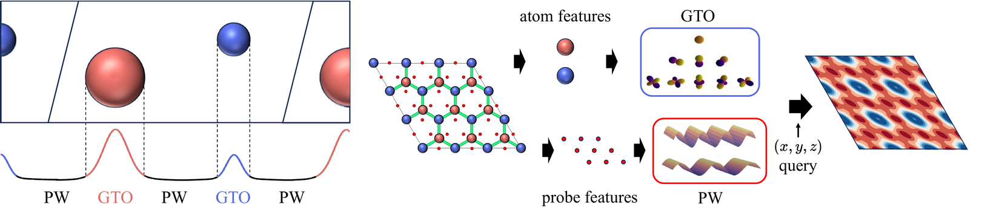

# GPWNO

[Gaussian Plane-Wave Neural Operator for Electron Density Estimation](https://arxiv.org/abs/2402.04278)

## Abstract

GPWNO is an equivariant neural operator for electron-density estimation. It combines atom-centered Gaussian basis functions with a plane-wave neural operator, allowing the model to capture both local atomic environments and global Fourier-space density patterns.

<div align="center">
  
</div>

---

## Model Description

### Overview

Given atom types and atomic coordinates, GPWNO predicts a continuous electron-density field. The model first learns local equivariant features around atoms, then refines the field with a plane-wave operator in Fourier space.

The main components are:

- Gaussian atom-centered density basis
- SE(3)-equivariant coefficient learning
- Plane-wave neural operator refinement
- Optional periodic-boundary support for crystalline systems

### Method

#### 1) Gaussian basis expansion

The electron density is represented with atom-centered basis functions:

$$
\hat{\rho}(x) =
\sum_i \sum_{n,l,m}
c_{i,nlm}\,g_n(\|x-r_i\|)\,Y_{lm}(\widehat{x-r_i})
$$

where $g_n$ is a radial Gaussian basis and $Y_{lm}$ is a spherical harmonic basis. The learnable part is the coefficient tensor $c_{i,nlm}$.

#### 2) Equivariant local message passing

GPWNO learns basis coefficients with equivariant message passing over the atomic graph. Edge features are built from interatomic distances and angular information, preserving rotation and translation behavior needed for density prediction.

#### 3) Plane-wave neural operator

After local coefficient learning, GPWNO applies a Fourier-space operator to improve global consistency:

$$
\rho_{\mathrm{out}} = \mathcal{F}^{-1}
\left(
W(k)\,\mathcal{F}(\rho_{\mathrm{local}})
\right)
$$

The Fourier module is controlled mainly by `num_fourier`, `num_fourier_time`, `width`, `fourier_mode`, `padding`, and `using_ff`.

#### 4) Training objective and metric

The model is trained with point-wise density regression on sampled grid points. The commonly reported metric is Normalized Mean Absolute Error:

$$
\mathrm{NMAE} =
\frac{\sum_i |\hat{\rho}(x_i)-\rho(x_i)|}
{\sum_i |\rho(x_i)|}
$$

---

## Dataset Description

**MD17_EC.** This molecular-dynamics electron-density dataset contains six small molecules: ethanol, benzene, phenol, resorcinol, ethane, and malonaldehyde. The first four molecules use 1,000 training geometries and 500 test geometries; ethane and malonaldehyde use 2,000 and 400, respectively. Each molecule is trained independently. [Download the PaddleMaterials package](https://paddle-org.bj.bcebos.com/paddlematerials/datasets/MD17_ES/md17_es.tar.gz).

**QM9_EC.** QM9 contains 133,884 small molecules composed of C, H, O, N, and F. Its electron-density benchmark contains 123,835 training samples, 50 validation samples, and 10,000 test samples. The PaddleMaterials reader uses the metadata and split files together with the compressed charge-density files.

**MP_EC.** The Materials Project benchmark contains electron densities for inorganic crystals. After invalid files are filtered, the structures are grouped into seven crystal systems. This PR provides the cubic-system configuration. [Download densities](https://paddle-org.bj.bcebos.com/paddlematerials/datasets/MP_ES/mp_es.tar), [atom dictionary](https://paddle-org.bj.bcebos.com/paddlematerials/datasets/MP_ES/crystal.json), and [split file](https://paddle-org.bj.bcebos.com/paddlematerials/datasets/MP_ES/crystal_data_split.json).

---

## Results

<table>
    <thead>
        <tr>
            <th nowrap="nowrap">Model Name</th>
            <th nowrap="nowrap">Dataset</th>
            <th nowrap="nowrap">Validation NMAE</th>
            <th nowrap="nowrap">Test NMAE</th>
            <th nowrap="nowrap">Paper test NMAE</th>
            <th nowrap="nowrap">Evaluation scope</th>
            <th nowrap="nowrap">GPUs</th>
            <th nowrap="nowrap">Training time</th>
            <th nowrap="nowrap">Config</th>
            <th nowrap="nowrap">Checkpoint | Log</th>
        </tr>
    </thead>
    <tbody>
        <tr>
            <td nowrap="nowrap">gpwno_md17_benzene</td>
            <td nowrap="nowrap">MD17_EC_Benzene</td>
            <td nowrap="nowrap">3.5567%</td>
            <td nowrap="nowrap">-</td>
            <td nowrap="nowrap">2.45%</td>
            <td nowrap="nowrap">Validation only (10 epochs)</td>
            <td nowrap="nowrap">1</td>
            <td nowrap="nowrap">15hour33min</td>
            <td nowrap="nowrap"><a href="../../../electronic_structure/configs/gpwno/gpwno_md17_benzene.yaml">gpwno_md17_benzene</a></td>
            <td nowrap="nowrap">TBD</td>
        </tr>
        <tr>
            <td nowrap="nowrap">gpwno_md17_ethane</td>
            <td nowrap="nowrap">MD17_EC_Ethane</td>
            <td nowrap="nowrap">4.8302%</td>
            <td nowrap="nowrap">4.8339%</td>
            <td nowrap="nowrap">3.67%</td>
            <td nowrap="nowrap">Validation and test</td>
            <td nowrap="nowrap">1</td>
            <td nowrap="nowrap">52hour18min</td>
            <td nowrap="nowrap"><a href="../../../electronic_structure/configs/gpwno/gpwno_md17_ethane.yaml">gpwno_md17_ethane</a></td>
            <td nowrap="nowrap">TBD</td>
        </tr>
        <tr>
            <td nowrap="nowrap">gpwno_qm9</td>
            <td nowrap="nowrap">QM9_EC</td>
            <td nowrap="nowrap">7.0865%</td>
            <td nowrap="nowrap">7.4001%</td>
            <td nowrap="nowrap">0.73%</td>
            <td nowrap="nowrap">Validation and test (2 epochs)</td>
            <td nowrap="nowrap">3</td>
            <td nowrap="nowrap">36hour33min</td>
            <td nowrap="nowrap"><a href="../../../electronic_structure/configs/gpwno/gpwno_qm9.yaml">gpwno_qm9</a></td>
            <td nowrap="nowrap">TBD</td>
        </tr>
        <tr>
            <td nowrap="nowrap">gpwno_mp</td>
            <td nowrap="nowrap">MP_EC (cubic)</td>
            <td nowrap="nowrap">34.8928%</td>
            <td nowrap="nowrap">37.8910%</td>
            <td nowrap="nowrap">4.32%</td>
            <td nowrap="nowrap">Validation and test</td>
            <td nowrap="nowrap">1</td>
            <td nowrap="nowrap">37hour46min</td>
            <td nowrap="nowrap"><a href="../../../electronic_structure/configs/gpwno/gpwno_mp.yaml">gpwno_mp</a></td>
            <td nowrap="nowrap">TBD</td>
        </tr>
    </tbody>
</table>

---

## Command

### Training

```bash
# single-gpu training
python electronic_structure/train.py -c electronic_structure/configs/gpwno/gpwno_md17_ethane.yaml

# multi-gpu training
python -m paddle.distributed.launch --gpus="0,1,2,3" electronic_structure/train.py -c electronic_structure/configs/gpwno/gpwno_md17_benzene.yaml

# QM9_EC multi-gpu training
python -m paddle.distributed.launch --gpus="0,1,2" electronic_structure/train.py -c electronic_structure/configs/gpwno/gpwno_qm9.yaml

# resume training from checkpoint
python -m paddle.distributed.launch --gpus="0,1,2" electronic_structure/train.py -c electronic_structure/configs/gpwno/gpwno_qm9.yaml Trainer.resume_from_checkpoint='path/to/checkpoints/latest'
```

### Validation

```bash
python electronic_structure/train.py -c electronic_structure/configs/gpwno/gpwno_md17_ethane.yaml Global.do_train=False Global.do_eval=True Global.do_test=False Trainer.pretrained_model_path='path/to/model.pdparams'

python electronic_structure/train.py -c electronic_structure/configs/gpwno/gpwno_qm9.yaml Global.do_train=False Global.do_eval=True Global.do_test=False Trainer.pretrained_model_path='path/to/checkpoints/best.pdparams'
```

### Testing

```bash
python electronic_structure/train.py -c electronic_structure/configs/gpwno/gpwno_md17_ethane.yaml Global.do_train=False Global.do_eval=False Global.do_test=True Trainer.pretrained_model_path='path/to/model.pdparams'

python electronic_structure/train.py -c electronic_structure/configs/gpwno/gpwno_qm9.yaml Global.do_train=False Global.do_eval=False Global.do_test=True Trainer.pretrained_model_path='path/to/checkpoints/best.pdparams'
```

### Prediction

```bash
python electronic_structure/predict.py \
  --config_path electronic_structure/configs/gpwno/gpwno_md17_ethane.yaml \
  --checkpoint_path path/to/model.pdparams \
  --input_path path/to/molecule.mol \
  --input_format mol \
  --output_path ./results
```

The unified `FieldPredictor` also accepts `xyz`, `cif`, `cube`, `chgcar`, and
`json` inputs. Use `--grid_batch_size` to limit the number of field points in
each inference pass when needed.

---

## Citation

```bibtex
@inproceedings{kim2024gaussian,
  title={Gaussian Plane-Wave Neural Operator for Electron Density Estimation},
  author={Kim, Seongsu and Ahn, Sungsoo},
  booktitle={International Conference on Machine Learning},
  year={2024}
}
```
