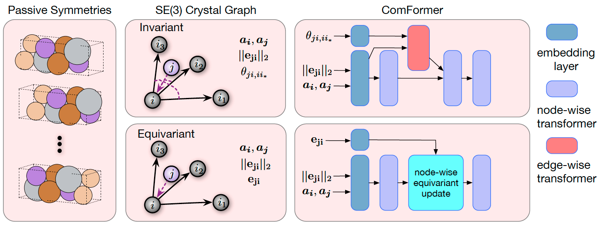

# ComFormer

[COMPLETE AND EFFICIENT GRAPH TRANSFORMERS FOR CRYSTAL MATERIAL PROPERTY PREDICTION](https://arxiv.org/pdf/2403.11857)

## Abstract

Crystal structures are characterized by atomic bases within a primitive unit cell that repeats along a regular lattice throughout 3D space. The periodic and infinite nature of crystals poses unique challenges for geometric graph representation learning. Specifically, constructing graphs that effectively capture the complete geometric information of crystals and handle chiral crystals remains an unsolved and challenging problem. In this paper, we introduce a novel approach that utilizes the periodic patterns of unit cells to establish the lattice-based representation for each atom, enabling efficient and expressive graph representations of crystals. Furthermore, we propose ComFormer, a SE(3) transformer designed specifically for crystalline materials. ComFormer includes two variants; namely, iComFormer that employs invariant geometric descriptors of Euclidean distances and angles, and eComFormer that utilizes equivariant vector representations. Experimental results demonstrate the state-of-the-art predictive accuracy of ComFormer variants on various tasks across three widely-used crystal benchmarks.




## Datasets:

- MP2018.6.1:

    The original dataset can download from [here](https://figshare.com/ndownloader/files/15087992). Following the methodology outlined in the Comformer paper, we randomly partitioned the dataset into subsets, with the specific sample sizes for each subset detailed in the table below.

    |                                   Dataset                                    | Train |  Val  | Test  |
    | :--------------------------------------------------------------------------: | :---: | :---: | :---: |
    | [mp2018_train_60k](https://pan.baidu.com/s/1GyjEyW9kL9OZiO15P5LuKQ?pwd=uzzg) | 60000 | 5000  | 4239  |

## formation energy per atom

<table>
    <head>
        <tr>
            <th  nowrap="nowrap">Model</th>
            <th  nowrap="nowrap">Dataset</th>
            <th  nowrap="nowrap">MAE(Val / Test dataset)</th>
            <th  nowrap="nowrap">GPUs</th>
            <th  nowrap="nowrap">Training time</th>
            <th  nowrap="nowrap">Config</th>
            <th  nowrap="nowrap">Checkpoint | Log</th>
        </tr>
    </head>
    <body>
        <tr>
            <td  nowrap="nowrap">Comformer</td>
            <td  nowrap="nowrap">mp2018_train_60k</td>
            <td  nowrap="nowrap">0.0168 / 0.0176</td>
            <td  nowrap="nowrap">4</td>
            <td  nowrap="nowrap">10.3 hours</td>
            <td  nowrap="nowrap"><a href="comformer_mp2018_train_60k_e_form.yaml">comformer_mp2018_train_60k_e_form</a></td>
            <td  nowrap="nowrap"><a href="Comming Soon">checkpoint | log</a></td>
        </tr>
    </body>
</table>

### Training
```bash
# multi-gpu training, we use 4 gpus here
python -m paddle.distributed.launch --gpus="0,1,2,3" property_prediction/train.py -c property_prediction/configs/comformer/comformer_mp2018_train_60k_e_form.yaml
# single-gpu training
python property_prediction/train.py -c property_prediction/configs/comformer/comformer_mp2018_train_60k_e_form.yaml
```

### Validation
```bash
python property_prediction/train.py -c property_prediction/configs/comformer/comformer_mp2018_train_60k_e_form.yaml Global.do_eval=True Global.do_train=False
```

### Testing
```bash
python property_prediction/train.py -c property_prediction/configs/comformer/comformer_mp2018_train_60k_e_form.yaml Global.do_test=True Global.do_train=False
```

### Prediction

```bash
python property_prediction/predict.py
```


## Citation
```
@inproceedings{yan2024complete,
  title={Complete and Efficient Graph Transformers for Crystal Material Property Prediction},
  author={Yan, Keqiang and Fu, Cong and Qian, Xiaofeng and Qian, Xiaoning and Ji, Shuiwang},
  booktitle={International Conference on Learning Representations},
  year={2024}
}
```
