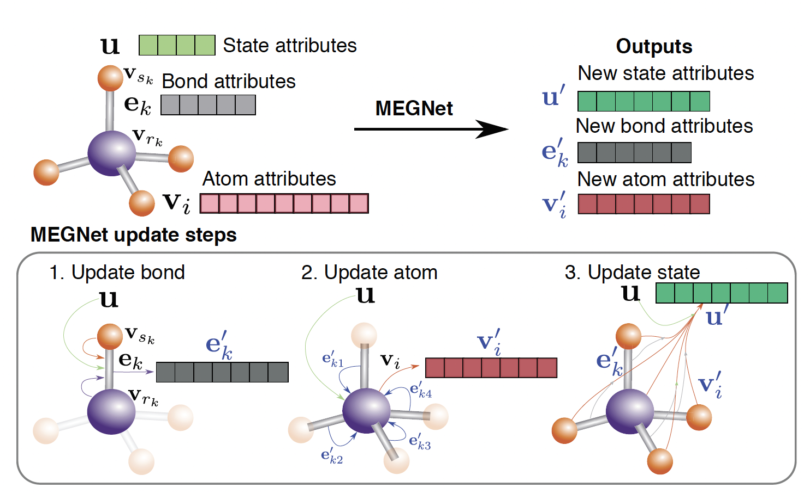

# MegNet

[Graph Networks as a Universal Machine Learning Framework for Molecules and Crystals](https://arxiv.org/abs/1812.05055)

## Abstract

Graph networks are a new machine learning (ML) paradigm that supports both relational reasoning and combinatorial generalization. Here, we develop universal MatErials Graph Network (MEGNet) models for accurate property prediction in both molecules and crystals. We demonstrate that the MEGNet models outperform prior ML models such as the SchNet in 11 out of 13 properties of the QM9 molecule data set. Similarly, we show that MEGNet models trained on ∼60,000 crystals in the Materials Project substantially outperform prior ML models in the prediction of the formation energies, band gaps and elastic moduli of crystals, achieving better than DFT accuracy over a much larger data set. We present two new strategies to address data limitations common in materials science and chemistry. First, we demonstrate a physically-intuitive approach to unify four separate molecular MEGNet models for the internal energy at 0 K and room temperature, enthalpy and Gibbs free energy into a single free energy MEGNet model by incorporating the temperature, pressure and entropy as global state inputs. Second, we show that the learned element embeddings in MEGNet models encode periodic chemical trends and can be transfer-learned from a property model trained on a larger data set (formation energies) to improve property models with smaller amounts of data (band gaps and elastic moduli).




## Datasets:

- MP2018.6.1:

    The original dataset can download from [here](https://figshare.com/ndownloader/files/15087992). Following the methodology outlined in the Comformer paper, we randomly partitioned the dataset into subsets, with the specific sample sizes for each subset detailed in the table below.

    |                                   Dataset                                    | Train |  Val  | Test  |
    | :--------------------------------------------------------------------------: | :---: | :---: | :---: |
    | [mp2018_train_60k](https://paddle-org.bj.bcebos.com/paddlematerial/datasets/mp2018/mp2018_train_60k.zip) | 60000 | 5000  | 4239  |

## Results

<table>
    <head>
        <tr>
            <th  nowrap="nowrap">Model</th>
            <th  nowrap="nowrap">Dataset</th>
            <th  nowrap="nowrap">Property</th>
            <th  nowrap="nowrap">MAE(Val / Test dataset)</th>
            <th  nowrap="nowrap">GPUs</th>
            <th  nowrap="nowrap">Training time</th>
            <th  nowrap="nowrap">Config</th>
            <th  nowrap="nowrap">Checkpoint | Log</th>
        </tr>
    </head>
    <body>
        <tr>
            <td  nowrap="nowrap">Comformer</td>
            <td  nowrap="nowrap">mp2018_train_60k</td>
            <th  nowrap="nowrap">Form. Energy(eV/atom)</th>
            <td  nowrap="nowrap">0.0283 / 0.0265</td>
            <td  nowrap="nowrap">1</td>
            <td  nowrap="nowrap">~15 hours</td>
            <td  nowrap="nowrap"><a href="megnet_mp2018_train_60k_e_form.yaml">megnet_mp2018_train_60k_e_form</a></td>
            <td  nowrap="nowrap"><a href="https://paddle-org.bj.bcebos.com/paddlematerial/checkpoints/property_prediction/megnet/megnet_mp2018_train_60k_e_form.zip">checkpoint | log</a></td>
        </tr>
    </body>
</table>

### Training
```bash
# formation energy per atom
# multi-gpu training, we use 4 gpus here
python -m paddle.distributed.launch --gpus="0,1,2,3" property_prediction/train.py -c property_prediction/configs/megnet/megnet_mp2018_train_60k_e_form.yaml
# single-gpu training
python property_prediction/train.py -c property_prediction/configs/megnet/megnet_mp2018_train_60k_e_form.yaml

```

### Validation
```bash
# Adjust program behavior on-the-fly using command-line parameters – this provides a convenient way to customize settings without modifying the configuration file directly.
# such as: --Global.do_eval=True

# formation energy per atom
python property_prediction/train.py -c property_prediction/configs/megnet/megnet_mp2018_train_60k_e_form.yaml Global.do_eval=True Global.do_train=False Global.do_test=False
```

### Testing
```bash
# This command is used to evaluate the model's performance on the test dataset.

# formation energy per atom
python property_prediction/train.py -c property_prediction/configs/megnet/megnet_mp2018_train_60k_e_form.yaml Global.do_test=True Global.do_train=False Global.do_eval=False

```

### Prediction

```bash
# This command is used to predict the properties of new crystal structures using a trained model.
# Note: The model_name and weights_name parameters are used to specify the pre-trained model and its corresponding weights. The cif_file_path parameter is used to specify the path to the CIF files for which properties need to be predicted.
# The prediction results will be saved in a CSV file specified by the save_path parameter. Default save_path is 'result.csv'.

# formation energy per atom

# Mode 1: Leverage a pre-trained machine learning model for crystal formation energy prediction. The implementation includes automated model download functionality, eliminating the need for manual configuration.
python property_prediction/predict.py --model_name='megnet_mp2018_train_60k_e_form' --weights_name='best.pdparams' --cif_file_path='./property_prediction/example_data/cifs/'

# Mode2: Use a custom configuration file and checkpoint for crystal formation energy prediction. This approach allows for more flexibility and customization.
python property_prediction/predict.py --config_path='property_prediction/configs/megnet/megnet_mp2018_train_60k_e_form.yaml' --checkpoint_path='you_checkpoint_path.pdparams' --cif_file_path='./property_prediction/example_data/cifs/'

```


## Citation
```
@article{chen2019graph,
  title={Graph networks as a universal machine learning framework for molecules and crystals},
  author={Chen, Chi and Ye, Weike and Zuo, Yunxing and Zheng, Chen and Ong, Shyue Ping},
  journal={Chemistry of Materials},
  volume={31},
  number={9},
  pages={3564--3572},
  year={2019},
  publisher={ACS Publications}
}
```
