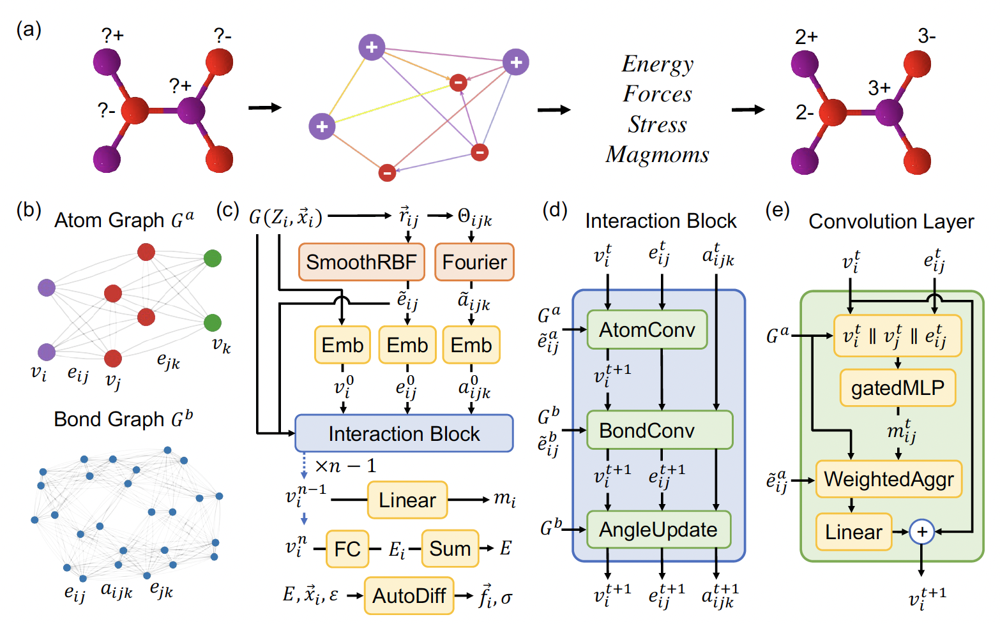

# CHGNet

[CHGNet: Pretrained universal neural network potential for charge-informed atomistic modeling](https://www.nature.com/articles/s42256-023-00716-3)

## Abstract

The simulation of large-scale systems with complex electron interactions remains one of the greatest challenges for the atomistic modeling of materials. Although classical force fields often fail to describe the coupling between electronic states and ionic rearrangements, the more accurate ab-initio molecular dynamics suffers from computational complexity that prevents long-time and large-scale simulations, which are essential to study many technologically relevant phenomena, such as reactions, ion migrations, phase transformations, and degradation. In this work, we present the Crystal Hamiltonian Graph neural Network (CHGNet) as a novel machine-learning interatomic potential (MLIP), using a graph-neural-network-based force field to model a universal potential energy surface. CHGNet is pretrained on the energies, forces, stresses, and magnetic moments from the Materials Project Trajectory Dataset, which consists of over 10 years of density functional theory static and relaxation trajectories of ∼ 1.5 million inorganic structures. The explicit inclusion of magnetic moments enables CHGNet to learn and accurately represent the orbital occupancy of electrons, enhancing its capability to describe both atomic and electronic degrees of freedom. We demonstrate several applications of CHGNet in solid-state materials, including charge-informed molecular dynamics in LixMnO2, the finite temperature phase diagram for LixFePO4 and Li diffusion in garnet conductors. We critically analyze the significance of including charge information for capturing appropriate chemistry, and we provide new insights into ionic systems with additional electronic degrees of freedom that can not be observed by previous MLIPs.



## Datasets:

- MPtrj_2022.9_full:

    The original dataset can download from [here](https://figshare.com/articles/dataset/Materials_Project_Trjectory_MPtrj_Dataset/23713842).

    This dataset contains 145,923 compounds, 1,580,395 structures with corresponding:
    - 1,580,395 energies
    - 7,944,833 magnetic moments
    - 49,295,660 forces
    - 14,223,555 stresses

    All data originates from GGA/GGA+U static/relaxation trajectories in the 2022.9 Materials Project release. The dataset employs a selection protocol that excludes incompatible calculations and duplicate structures.

    Following the methodology outlined in the CHGNet paper, we randomly partitioned the dataset into subsets based on the mp-id, with the specific sample sizes for each subset detailed in the table below.

    |                                   Dataset                                    | Train |  Val  | Test  |
    | :--------------------------------------------------------------------------: | :---: | :---: | :---: |
    | [MPtrj_2022.9_full](https://paddle-org.bj.bcebos.com/paddlematerial/datasets/mptrj/MPtrj_2022.9_full.zip) | 116738 | 14592  | 14593  |

## Results

<table>
    <head>
        <tr>
            <th  nowrap="nowrap">Model Name</th>
            <th  nowrap="nowrap">Dataset</th>
            <th  nowrap="nowrap">Energy MAE(meV/atom)</th>
            <th  nowrap="nowrap">Force MAE(meV/A)</th>
            <th  nowrap="nowrap">Stress MAE(GPa)</th>
            <th  nowrap="nowrap">Magmom MAE(μB)</th>
            <th  nowrap="nowrap">GPUs</th>
            <th  nowrap="nowrap">Training time</th>
            <th  nowrap="nowrap">Config</th>
            <th  nowrap="nowrap">Checkpoint | Log</th>
        </tr>
    </head>
    <body>
        <tr>
            <td  nowrap="nowrap">chgnet_mptrj</td>
            <td  nowrap="nowrap">MPtrj_2022.9_full</td>
            <td  nowrap="nowrap">30</td>
            <td  nowrap="nowrap">77</td>
            <td  nowrap="nowrap">4.348</td>
            <td  nowrap="nowrap">0.032</td>
            <td  nowrap="nowrap"> ~ </td>
            <td  nowrap="nowrap"> ~ </td>
            <td  nowrap="nowrap"><a href="chgnet_mptrj.yaml">chgnet_mptrj</a></td>
            <td  nowrap="nowrap"><a href="https://paddle-org.bj.bcebos.com/paddlematerial/checkpoints/interatomic_potentials/chgnet/chgnet_mptrj.zip">checkpoint | log</a></td>
        </tr>  
    </body>
</table>

**Note**: The model weights were directly adapted from the [CHGNet](https://github.com/CederGroupHub/chgnet) repository. Since the original paper did not disclose its randomly split test set, we repartitioned the test data according to the proportions described in the paper. However, due to differences in random seeds, the data partitioning could not be fully replicated, limiting the referential value of evaluation results obtained with our test set. To ensure result comparability, the MAE metrics listed in the table are directly cited from the original [paper's](https://www.nature.com/articles/s42256-023-00716-3) experimental results.

### Training

```bash
# multi-gpu training
python -m paddle.distributed.launch --gpus="0,1,2,3" experiments/interatomic_potentials/train.py --config-name task_chgnet/chgnet_mptrj.yaml


# single-gpu training
python experiments/interatomic_potentials/train.py --config-name task_chgnet/chgnet_mptrj.yaml
```

### Validation
```bash
# Adjust program behavior on-the-fly using command-line parameters – this provides a convenient way to customize settings without modifying the configuration file directly.
# such as: --Global.do_eval=True

python experiments/interatomic_potentials/train.py --config-name task_chgnet/chgnet_mptrj.yaml Global.do_train=False Global.do_eval=True Global.do_test=False Trainer.pretrained_model_path='your checkpoint path(*.pdparams)'
```


### Testing
```bash
# This command is used to evaluate the model's performance on the test dataset.

python experiments/interatomic_potentials/train.py --config-name task_chgnet/chgnet_mptrj.yaml Global.do_train=False Global.do_test=True Global.do_eval=False Trainer.pretrained_model_path='your checkpoint path(*.pdparams)'
```

### Prediction

```bash
# This command is used to predict the properties of new crystal structures using a trained model.
# Note: The model_name and weights_name parameters are used to specify the pre-trained model and its corresponding weights. The cif_file_path parameter is used to specify the path to the CIF files for which properties need to be predicted.
# The prediction results will be saved in a CSV file specified by the save_path parameter. Default save_path is 'result.csv'.


# Mode 1: Leverage a pre-trained machine learning model for crystal shear moduli prediction. The implementation includes automated model download functionality, eliminating the need for manual configuration.
python experiments/interatomic_potentials/predict.py --config-name predict Model.model_name='chgnet_mptrj' System=load_system System.file_path='experiments/interatomic_potentials/example_data/cifs'


# Mode2: Use a custom configuration file and checkpoint for crystal shear moduli prediction. This approach allows for more flexibility and customization.
python experiments/interatomic_potentials/predict.py --config-name predict Model.config_path='your config path(*.yaml)' Model.checkpoint_path='your checkpoint path(*.pdparams)' System=load_system System.file_path='./experiments/interatomic_potentials/example_data/cifs/'

```

### Simulation Tasks
This section explains how to run Molecular Dynamics (MD) or structure optimization tasks using the ASE interface. These tasks are executed via the ppmatSim/main.py script.

You can override any YAML parameter directly from the command line using parameter=value, or write your own YAML configuration.

The Hydra output directory automatically includes the job name and timestamp, so results are well organized and won't be overwritten.

| Section            | Parameter         | Description                                                    |
| ------------------ | ----------------- | -------------------------------------------------------------- |
| `device`           | `cuda`            | Device for computations (`cpu` or `cuda`)                      |
| `model/load_model` | `model_name`      | Pre-trained model name                                         |
|                    | `config_path`     | Path to YAML config (used with checkpoint)                     |
|                    | `checkpoint_path` | Path to model checkpoint (*.pdparams)                          |
| `system`           | `load_system`     | Load initial system from file                                  |
|                    | `ase_create`      | Generate system using ASE                                      |
| `task`             | `md`, `opt`       | Task type: `md` for molecular dynamics, `opt` for optimization |
| `calculator`       | `ase`             | Backend interface (ASE in this case)                           |


#### 1. Running Molecular Dynamics (MD) Simulation (with ASE backend)

The MD simulation is implemented in the function
ASECalculator.run_md() within ppmat/calculator/ase.py

By default, it uses the ASE Langevin integrator for time evolution:
```bash
dyn = Langevin(
      atoms,
      timestep=timestep * units.fs,
      temperature_K=temperature,
      friction=0.01 / units.fs,
)
```
This setup enables NVT dynamics with stochastic thermalization, suitable for general-purpose molecular simulations.

Example Usage:
```bash
# Option A: Use a pre-trained model by name
python ppmatSim/main.py --config-name md_ase Model.model_name='chgnet_mptrj'

# Option B: Use a custom config and checkpoint
python ppmatSim/main.py --config-name md_ase Model.config_path='your config path(*.yaml)' Model.checkpoint_path='your checkpoint path(*.pdparams)'
```

After the simulation, the generated trajectory (.traj) file can be easily converted to an .xyz file for visualization:
```bash
# Trajectory file (.traj) can be converted to XYZ file:
ase convert <trajectory_file>.traj <output_file>.xyz
```


Customization Example:

Users can easily replace the default integrator with other ASE MD engines, such as IsotropicMTKNPT for NPT ensemble simulations or custom pre-relaxation steps.For example:
```bash
from ase.optimize import QuasiNewton
from ase.geometry.analysis import Analysis
from ase.md.velocitydistribution import (
    MaxwellBoltzmannDistribution,
    Stationary,
    ZeroRotation,
)
from ase.md.nose_hoover_chain import IsotropicMTKNPT
from ase.md.analysis import DiffusionCoefficient

# Quick relaxation of the initial structure
qn = QuasiNewton(atoms)
qn.run(fmax=0.001, steps=10)

# Initialize velocities and remove net translation/rotation
MaxwellBoltzmannDistribution(atoms, temperature_K=300)
Stationary(atoms)
ZeroRotation(atoms)

# Run MD with NPT ensemble
dyn = IsotropicMTKNPT(
    atoms=atoms,
    timestep=timestep * units.fs,
    temperature_K=temperature,
    pressure_au=1 * units.bar,
    tdamp=100,
    pdamp=1000,
    logfile=log_file,
)

```
This flexibility allows users to test different thermodynamic ensembles or thermostats/barostats directly within the ASE interface.

> Coming soon: Examples for running MD with the **LAMMPS backend** will be provided in the next release.


#### 2. Running Structure Optimization (with ASE backend)

Structure optimization is supported through ASE’s built-in optimizers.
In the source code, the optimizer class and filter type can be specified via configuration.

The filter (e.g., FrechetCellFilter) is used to apply optimization constraints on both atomic positions and cell parameters, ensuring stable relaxation for periodic systems.

Available Optimizers
```bash
FIRE
BFGS
LBFGS
MDMin
GPMin
LBFGSLineSearch
BFGSLineSearch
```

Default Settings
```bash
optimizer: "LBFGS"
filter: "FrechetCellFilter"
```

Example Usage:
```bash
# Option A: Use a pre-trained model by name
python ppmatSim/main.py --config-name optimizer_ase Model.model_name='chgnet_mptrj'

# Option B: Use a custom config and checkpoint
python ppmatSim/main.py --config-name optimizer_ase Model.config_path='your config path(*.yaml)' Model.checkpoint_path='your checkpoint path(*.pdparams)'
```


## Citation
```
@article{deng2023chgnet,
  title={CHGNet as a pretrained universal neural network potential for charge-informed atomistic modelling},
  author={Deng, Bowen and Zhong, Peichen and Jun, KyuJung and Riebesell, Janosh and Han, Kevin and Bartel, Christopher J and Ceder, Gerbrand},
  journal={Nature Machine Intelligence},
  volume={5},
  number={9},
  pages={1031--1041},
  year={2023},
  publisher={Nature Publishing Group UK London}
}
```
