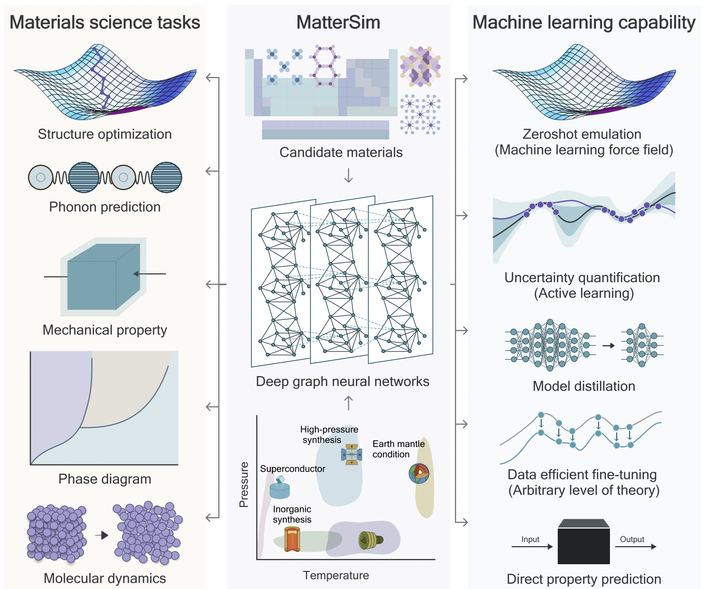

# MatterSim

[MatterSim: A Deep Learning Atomistic Model Across Elements, Temperatures and Pressures](https://arxiv.org/abs/2405.04967)

## Abstract

Accurate and fast prediction of materials properties is central to the digital transformation of materials design. However, the vast design space and diverse operating conditions pose significant challenges for accurately modeling arbitrary material candidates and forecasting their properties. We present MatterSim, a deep learning model actively learned from large-scale first-principles computations, for efficient atomistic simulations at first-principles level and accurate prediction of broad material properties across the periodic table, spanning temperatures from 0 to 5000 K and pressures up to 1000 GPa. Out-of-the-box, the model serves as a machine learning force field, and shows remarkable capabilities not only in predicting ground-state material structures and energetics, but also in simulating their behavior under realistic temperatures and pressures, signifying an up to ten-fold enhancement in precision compared to the prior best-in-class. This enables MatterSim to compute materials' lattice dynamics, mechanical and thermodynamic properties, and beyond, to an accuracy comparable with first-principles methods. Specifically, MatterSim predicts Gibbs free energies for a wide range of inorganic solids with near-first-principles accuracy and achieves a 15 meV/atom resolution for temperatures up to 1000K compared with experiments. This opens an opportunity to predict experimental phase diagrams of materials at minimal computational cost. Moreover, MatterSim also serves as a platform for continuous learning and customization by integrating domain-specific data. The model can be fine-tuned for atomistic simulations at a desired level of theory or for direct structure-to-property predictions, achieving high data efficiency with a reduction in data requirements by up to 97%.



## Pre-trained Models

1. MatterSim-v1.0.0-1M: A mini version of the model that is faster to run.
2. MatterSim-v1.0.0-5M: A larger version of the model that is more accurate.


### Training

Fine-tune the mattersim_1M model using high_level_water.

```bash
# multi-gpu training
python -m paddle.distributed.launch --gpus="0,1,2,3" experiments/interatomic_potentials/train.py --config-name task_mattersim/mattersim_1M_high_level_water.yaml

# single-gpu training
python experiments/interatomic_potentials/train.py --config-name task_mattersim/mattersim_1M_high_level_water.yaml
```

Fine-tune the mattersim_5M model using high_level_water.

```bash
# multi-gpu training
python -m paddle.distributed.launch --gpus="0,1,2,3" experiments/interatomic_potentials/train.py --config-name task_mattersim/mattersim_5M_high_level_water.yaml

# single-gpu training
python experiments/interatomic_potentials/train.py --config-name task_mattersim/mattersim_5M_high_level_water.yaml
```

### Validation
```bash
# Adjust program behavior on-the-fly using command-line parameters – this provides a convenient way to customize settings without modifying the configuration file directly.
# such as: --Global.do_eval=True

python experiments/interatomic_potentials/train.py --config-name task_mattersim/mattersim_1M_high_level_water.yaml Global.do_train=False Global.do_eval=True Global.do_test=False Trainer.pretrained_model_path='your checkpoint path(*.pdparams)'
```


### Testing
```bash
# This command is used to evaluate the model's performance on the test dataset.

python experiments/interatomic_potentials/train.py --config-name task_mattersim/mattersim_1M_high_level_water.yaml Global.do_train=False Global.do_test=True Global.do_eval=False Trainer.pretrained_model_path='your checkpoint path(*.pdparams)'

```

### Prediction

```bash
# This command is used to predict the properties of new crystal structures using a trained model.
# Note: The model_name and weights_name parameters are used to specify the pre-trained model and its corresponding weights. The cif_file_path parameter is used to specify the path to the CIF files for which properties need to be predicted.
# The prediction results will be saved in a CSV file specified by the save_path parameter. Default save_path is 'result.csv'.


# Mode 1: Leverage a pre-trained machine learning model for crystal shear moduli prediction. The implementation includes automated model download functionality, eliminating the need for manual configuration.
python experiments/interatomic_potentials/predict.py --config-name predict Model.model_name='mattersim_1M' Model.weights_name='mattersim-v1.0.0-1M_model.pdparams' System=load_system System.file_path='./experiments/interatomic_potentials/example_data/cifs/'

python experiments/interatomic_potentials/predict.py --config-name predict Model.model_name='mattersim_5M' Model.weights_name='mattersim-v1.0.0-5M_model.pdparams' System=load_system System.file_path='./experiments/interatomic_potentials/example_data/cifs/'

# Mode2: Use a custom configuration file and checkpoint for crystal shear moduli prediction. This approach allows for more flexibility and customization.
python experiments/interatomic_potentials/predict.py --config-name predict Model.config_path='your config path(*.yaml)' Model.checkpoint_path='your checkpoint path(*.pdparams)' System=load_system System.file_path='./experiments/interatomic_potentials/example_data/cifs/'
```


### Simulation Tasks
This section explains how to run Molecular Dynamics (MD) or structure optimization tasks using the ASE interface. These tasks are executed via the ppmatSim/main.py script.

You can override any YAML parameter directly from the command line using parameter=value, or write your own YAML configuration.

The Hydra output directory automatically includes the job name and timestamp, so results are well organized and won't be overwritten.

| Section            | Parameter         | Description                                                    |
| ------------------ | ----------------- | -------------------------------------------------------------- |
| `device`           | `cuda`            | Device for computations (`cpu` or `cuda`)                      |
| `model/load_model` | `model_name`      | Pre-trained model name                                         |
|                    | `config_path`     | Path to YAML config (used with checkpoint)                     |
|                    | `checkpoint_path` | Path to model checkpoint (*.pdparams)                          |
| `system`           | `load_system`     | Load initial system from file                                  |
|                    | `ase_create`      | Generate system using ASE                                      |
| `task`             | `md`, `opt`       | Task type: `md` for molecular dynamics, `opt` for optimization |
| `calculator`       | `ase`             | Backend interface (ASE in this case)                           |


#### 1. Running Molecular Dynamics (MD) Simulation (with ASE backend)

The MD simulation is implemented in the function
ASECalculator.run_md() within ppmat/calculator/ase.py

By default, it uses the ASE Langevin integrator for time evolution:
```bash
dyn = Langevin(
      atoms,
      timestep=timestep * units.fs,
      temperature_K=temperature,
      friction=0.01 / units.fs,
)
```
This setup enables NVT dynamics with stochastic thermalization, suitable for general-purpose molecular simulations.

Example Usage:
```bash
# Option A: Use a pre-trained model by name
python ppmatSim/main.py --config-name md_ase Model.model_name='mattersim_1M'

# Option B: Use a custom config and checkpoint
python ppmatSim/main.py --config-name md_ase Model.config_path='your config path(*.yaml)' Model.checkpoint_path='your checkpoint path(*.pdparams)'
```

After the simulation, the generated trajectory (.traj) file can be easily converted to an .xyz file for visualization:
```bash
# Trajectory file (.traj) can be converted to XYZ file:
ase convert <trajectory_file>.traj <output_file>.xyz
```

Customization Example:

Users can easily replace the default integrator with other ASE MD engines, such as IsotropicMTKNPT for NPT ensemble simulations or custom pre-relaxation steps.For example:
```bash
from ase.optimize import QuasiNewton
from ase.geometry.analysis import Analysis
from ase.md.velocitydistribution import (
    MaxwellBoltzmannDistribution,
    Stationary,
    ZeroRotation,
)
from ase.md.nose_hoover_chain import IsotropicMTKNPT
from ase.md.analysis import DiffusionCoefficient

# Quick relaxation of the initial structure
qn = QuasiNewton(atoms)
qn.run(fmax=0.001, steps=10)

# Initialize velocities and remove net translation/rotation
MaxwellBoltzmannDistribution(atoms, temperature_K=300)
Stationary(atoms)
ZeroRotation(atoms)

# Run MD with NPT ensemble
dyn = IsotropicMTKNPT(
    atoms=atoms,
    timestep=timestep * units.fs,
    temperature_K=temperature,
    pressure_au=1 * units.bar,
    tdamp=100,
    pdamp=1000,
    logfile=log_file,
)

```
This flexibility allows users to test different thermodynamic ensembles or thermostats/barostats directly within the ASE interface.


> Coming soon: Examples for running MD with the **LAMMPS backend** will be provided in the next release.


#### 2. Running Structure Optimization (with ASE backend)

Structure optimization is supported through ASE’s built-in optimizers.
In the source code, the optimizer class and filter type can be specified via configuration.

The filter (e.g., FrechetCellFilter) is used to apply optimization constraints on both atomic positions and cell parameters, ensuring stable relaxation for periodic systems.

Available Optimizers
```bash
FIRE
BFGS
LBFGS
MDMin
GPMin
LBFGSLineSearch
BFGSLineSearch
```

Default Settings
```bash
optimizer: "LBFGS"
filter: "FrechetCellFilter"
```

Example Usage:
```bash
# Option A: Use a pre-trained model by name
python ppmatSim/main.py --config-name optimizer_ase Model.model_name='mattersim_1M'

# Option B: Use a custom config and checkpoint
python ppmatSim/main.py --config-name optimizer_ase Model.config_path='your config path(*.yaml)' Model.checkpoint_path='your checkpoint path(*.pdparams)'
```


## Citation
```
@article{yang2024mattersim,
      title={MatterSim: A Deep Learning Atomistic Model Across Elements, Temperatures and Pressures},
      author={Han Yang and Chenxi Hu and Yichi Zhou and Xixian Liu and Yu Shi and Jielan Li and Guanzhi Li and Zekun Chen and Shuizhou Chen and Claudio Zeni and Matthew Horton and Robert Pinsler and Andrew Fowler and Daniel Zügner and Tian Xie and Jake Smith and Lixin Sun and Qian Wang and Lingyu Kong and Chang Liu and Hongxia Hao and Ziheng Lu},
      year={2024},
      eprint={2405.04967},
      archivePrefix={arXiv},
      primaryClass={cond-mat.mtrl-sci},
      url={https://arxiv.org/abs/2405.04967},
      journal={arXiv preprint arXiv:2405.04967}
}
```
