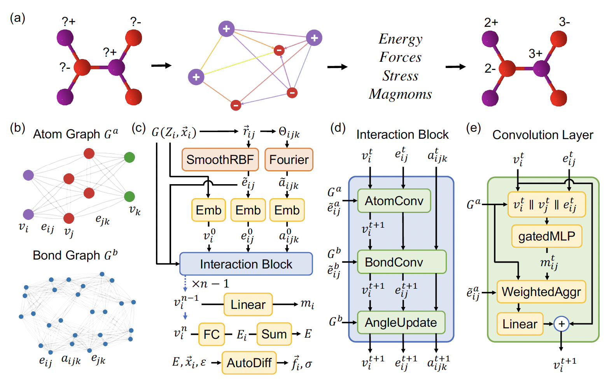

# CHGNet

[CHGNet: Pretrained universal neural network potential for charge-informed atomistic modeling](https://www.nature.com/articles/s42256-023-00716-3)

## Abstract

The simulation of large-scale systems with complex electron interactions remains one of the greatest challenges for the atomistic modeling of materials. Although classical force fields often fail to describe the coupling between electronic states and ionic rearrangements, the more accurate ab-initio molecular dynamics suffers from computational complexity that prevents long-time and large-scale simulations, which are essential to study many technologically relevant phenomena, such as reactions, ion migrations, phase transformations, and degradation. In this work, we present the Crystal Hamiltonian Graph neural Network (CHGNet) as a novel machine-learning interatomic potential (MLIP), using a graph-neural-network-based force field to model a universal potential energy surface. CHGNet is pretrained on the energies, forces, stresses, and magnetic moments from the Materials Project Trajectory Dataset, which consists of over 10 years of density functional theory static and relaxation trajectories of ∼ 1.5 million inorganic structures. The explicit inclusion of magnetic moments enables CHGNet to learn and accurately represent the orbital occupancy of electrons, enhancing its capability to describe both atomic and electronic degrees of freedom. We demonstrate several applications of CHGNet in solid-state materials, including charge-informed molecular dynamics in LixMnO2, the finite temperature phase diagram for LixFePO4 and Li diffusion in garnet conductors. We critically analyze the significance of including charge information for capturing appropriate chemistry, and we provide new insights into ionic systems with additional electronic degrees of freedom that can not be observed by previous MLIPs.



## Datasets:

- MPtrj_2022.9_full:

    The original dataset can download from [here](https://figshare.com/articles/dataset/Materials_Project_Trjectory_MPtrj_Dataset/23713842).

    This dataset contains 145,923 compounds, 1,580,395 structures with corresponding:
    - 1,580,395 energies
    - 7,944,833 magnetic moments
    - 49,295,660 forces
    - 14,223,555 stresses

    All data originates from GGA/GGA+U static/relaxation trajectories in the 2022.9 Materials Project release. The dataset employs a selection protocol that excludes incompatible calculations and duplicate structures.

    Following the methodology outlined in the CHGNet paper, we randomly partitioned the dataset into subsets based on the mp-id, with the specific sample sizes for each subset detailed in the table below.

    |                                   Dataset                                    | Train |  Val  | Test  |
    | :--------------------------------------------------------------------------: | :---: | :---: | :---: |
    | [MPtrj_2022.9_full](https://paddle-org.bj.bcebos.com/paddlematerial/datasets/mptrj/MPtrj_2022.9_full.zip) | 116738 | 14592  | 14593  |

## Results

<table>
    <head>
        <tr>
            <th  nowrap="nowrap">Model Name</th>
            <th  nowrap="nowrap">Dataset</th>
            <th  nowrap="nowrap">Energy MAE(meV/atom)</th>
            <th  nowrap="nowrap">Force MAE(meV/A)</th>
            <th  nowrap="nowrap">Stress MAE(GPa)</th>
            <th  nowrap="nowrap">Magmom MAE(μB)</th>
            <th  nowrap="nowrap">GPUs</th>
            <th  nowrap="nowrap">Training time</th>
            <th  nowrap="nowrap">Config</th>
            <th  nowrap="nowrap">Checkpoint | Log</th>
        </tr>
    </head>
    <body>
        <tr>
            <td  nowrap="nowrap">chgnet_mptrj</td>
            <td  nowrap="nowrap">MPtrj_2022.9_full</td>
            <td  nowrap="nowrap">30</td>
            <td  nowrap="nowrap">77</td>
            <td  nowrap="nowrap">4.348</td>
            <td  nowrap="nowrap">0.032</td>
            <td  nowrap="nowrap"> ~ </td>
            <td  nowrap="nowrap"> ~ </td>
            <td  nowrap="nowrap"><a href="chgnet_mptrj.yaml">chgnet_mptrj</a></td>
            <td  nowrap="nowrap"><a href="https://paddle-org.bj.bcebos.com/paddlematerial/checkpoints/interatomic_potentials/chgnet/chgnet_mptrj.zip">checkpoint | log</a></td>
        </tr>  
    </body>
</table>

**Note**: The model weights were directly adapted from the [CHGNet](https://github.com/CederGroupHub/chgnet) repository. Since the original paper did not disclose its randomly split test set, we repartitioned the test data according to the proportions described in the paper. However, due to differences in random seeds, the data partitioning could not be fully replicated, limiting the referential value of evaluation results obtained with our test set. To ensure result comparability, the MAE metrics listed in the table are directly cited from the original [paper's](https://www.nature.com/articles/s42256-023-00716-3) experimental results.

### Training

```bash
# multi-gpu training
python -m paddle.distributed.launch --gpus="0,1,2,3" interatomic_potentials/train.py -c interatomic_potentials/configs/chgnet/chgnet_mptrj.yaml
# single-gpu training
python interatomic_potentials/train.py -c interatomic_potentials/configs/chgnet/chgnet_mptrj.yaml
```

### Validation
```bash
# Adjust program behavior on-the-fly using command-line parameters – this provides a convenient way to customize settings without modifying the configuration file directly.
# such as: --Global.do_eval=True

python interatomic_potentials/train.py -c interatomic_potentials/configs/chgnet/chgnet_mptrj.yaml Global.do_eval=True Global.do_train=False Global.do_test=False Trainer.pretrained_model_path='your checkpoint path(*.pdparams)'

```


### Testing
```bash
# This command is used to evaluate the model's performance on the test dataset.

python interatomic_potentials/train.py -c interatomic_potentials/configs/chgnet/chgnet_mptrj.yaml Global.do_test=True Global.do_train=False Global.do_eval=False Trainer.pretrained_model_path='your checkpoint path(*.pdparams)'

```

### Prediction

```bash
# This command is used to predict the properties of new crystal structures using a trained model.
# Note: The model_name and weights_name parameters are used to specify the pre-trained model and its corresponding weights. The cif_file_path parameter is used to specify the path to the CIF files for which properties need to be predicted.
# The prediction results will be saved in a CSV file specified by the save_path parameter. Default save_path is 'result.csv'.


# Mode 1: Leverage a pre-trained machine learning model for crystal shear moduli prediction. The implementation includes automated model download functionality, eliminating the need for manual configuration.
python interatomic_potentials/predict.py --model_name='chgnet_mptrj' --cif_file_path='./interatomic_potentials/example_data/cifs/'

# Mode2: Use a custom configuration file and checkpoint for crystal shear moduli prediction. This approach allows for more flexibility and customization.
python interatomic_potentials/predict.py --config_path='interatomic_potentials/configs/chgnet/chgnet_mptrj.yaml' --checkpoint_path="your checkpoint path(*.pdparams)"
```


## Citation
```
@article{deng2023chgnet,
  title={CHGNet as a pretrained universal neural network potential for charge-informed atomistic modelling},
  author={Deng, Bowen and Zhong, Peichen and Jun, KyuJung and Riebesell, Janosh and Han, Kevin and Bartel, Christopher J and Ceder, Gerbrand},
  journal={Nature Machine Intelligence},
  volume={5},
  number={9},
  pages={1031--1041},
  year={2023},
  publisher={Nature Publishing Group UK London}
}
```
