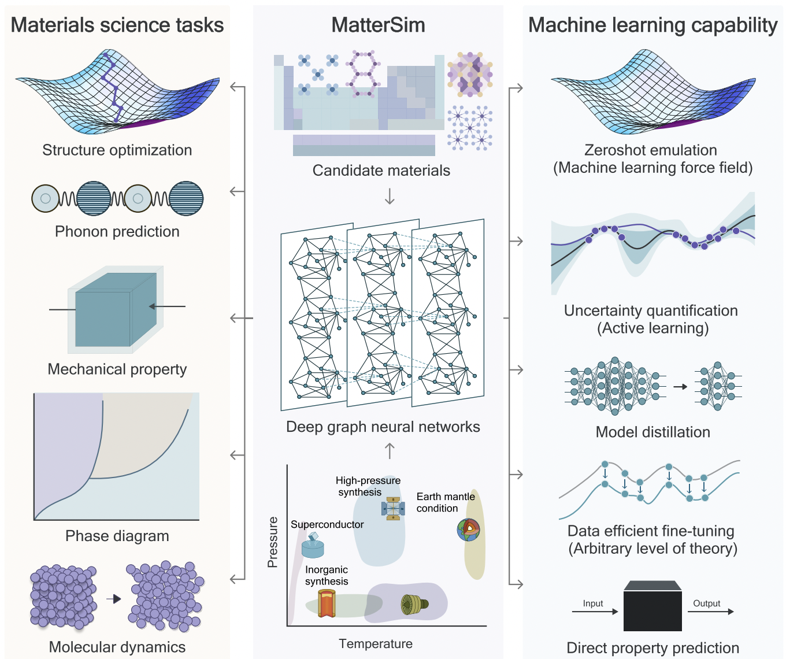

# MatterSim

[MatterSim: A Deep Learning Atomistic Model Across Elements, Temperatures and Pressures](https://arxiv.org/abs/2405.04967)

## Abstract

Accurate and fast prediction of materials properties is central to the digital transformation of materials design. However, the vast design space and diverse operating conditions pose significant challenges for accurately modeling arbitrary material candidates and forecasting their properties. We present MatterSim, a deep learning model actively learned from large-scale first-principles computations, for efficient atomistic simulations at first-principles level and accurate prediction of broad material properties across the periodic table, spanning temperatures from 0 to 5000 K and pressures up to 1000 GPa. Out-of-the-box, the model serves as a machine learning force field, and shows remarkable capabilities not only in predicting ground-state material structures and energetics, but also in simulating their behavior under realistic temperatures and pressures, signifying an up to ten-fold enhancement in precision compared to the prior best-in-class. This enables MatterSim to compute materials' lattice dynamics, mechanical and thermodynamic properties, and beyond, to an accuracy comparable with first-principles methods. Specifically, MatterSim predicts Gibbs free energies for a wide range of inorganic solids with near-first-principles accuracy and achieves a 15 meV/atom resolution for temperatures up to 1000K compared with experiments. This opens an opportunity to predict experimental phase diagrams of materials at minimal computational cost. Moreover, MatterSim also serves as a platform for continuous learning and customization by integrating domain-specific data. The model can be fine-tuned for atomistic simulations at a desired level of theory or for direct structure-to-property predictions, achieving high data efficiency with a reduction in data requirements by up to 97%.



## Pre-trained Models

1. MatterSim-v1.0.0-1M: A mini version of the model that is faster to run.
2. MatterSim-v1.0.0-5M: A larger version of the model that is more accurate.


### Training

Fine-tune the mattersim_1M model using high_level_water.

```bash
# multi-gpu training
python -m paddle.distributed.launch --gpus="0,1,2,3" interatomic_potentials/train.py -c interatomic_potentials/configs/mattersim/mattersim_1M_high_level_water.yaml
# single-gpu training
python interatomic_potentials/train.py -c interatomic_potentials/configs/mattersim/mattersim_1M_high_level_water.yaml
```

Fine-tune the mattersim_5M model using high_level_water.

```bash
# multi-gpu training
python -m paddle.distributed.launch --gpus="0,1,2,3" interatomic_potentials/train.py -c interatomic_potentials/configs/mattersim/mattersim_5M_high_level_water.yaml
# single-gpu training
python interatomic_potentials/train.py -c interatomic_potentials/configs/mattersim/mattersim_5M_high_level_water.yaml
```

### Validation
```bash
# Adjust program behavior on-the-fly using command-line parameters – this provides a convenient way to customize settings without modifying the configuration file directly.
# such as: --Global.do_eval=True

python interatomic_potentials/train.py -c interatomic_potentials/configs/mattersim/mattersim_1M_high_level_water.yaml Global.do_eval=True Global.do_train=False Global.do_test=False Trainer.pretrained_model_path='your checkpoint path(*.pdparams)'

```


### Testing
```bash
# This command is used to evaluate the model's performance on the test dataset.

python interatomic_potentials/train.py -c interatomic_potentials/configs/mattersim/mattersim_1M_high_level_water.yaml Global.do_test=True Global.do_train=False Global.do_eval=False Trainer.pretrained_model_path='your checkpoint path(*.pdparams)'

```

### Prediction

```bash
# This command is used to predict the properties of new crystal structures using a trained model.
# Note: The model_name and weights_name parameters are used to specify the pre-trained model and its corresponding weights. The cif_file_path parameter is used to specify the path to the CIF files for which properties need to be predicted.
# The prediction results will be saved in a CSV file specified by the save_path parameter. Default save_path is 'result.csv'.


# Mode 1: Leverage a pre-trained machine learning model for crystal shear moduli prediction. The implementation includes automated model download functionality, eliminating the need for manual configuration.
python interatomic_potentials/predict.py --model_name='mattersim_1M' --weights_name='mattersim-v1.0.0-1M_model.pdparams' --cif_file_path='./interatomic_potentials/example_data/cifs/'

python interatomic_potentials/predict.py --model_name='mattersim_5M' --weights_name='mattersim-v1.0.0-5M_model.pdparams' --cif_file_path='./interatomic_potentials/example_data/cifs/'

# Mode2: Use a custom configuration file and checkpoint for crystal shear moduli prediction. This approach allows for more flexibility and customization.
python interatomic_potentials/predict.py --config_path='interatomic_potentials/configs/mattersim/mattersim_1M.yaml' --checkpoint_path="/root/host/home/zhangzhimin04/workspaces_123/ppmat/PaddleMaterial_experimental/experimental/output/mattersim_1M/mattersim-v1.0.0-1M_model.pdparams" --cif_file_path='./interatomic_potentials/example_data/cifs/'
```


## Citation
```
@article{yang2024mattersim,
      title={MatterSim: A Deep Learning Atomistic Model Across Elements, Temperatures and Pressures},
      author={Han Yang and Chenxi Hu and Yichi Zhou and Xixian Liu and Yu Shi and Jielan Li and Guanzhi Li and Zekun Chen and Shuizhou Chen and Claudio Zeni and Matthew Horton and Robert Pinsler and Andrew Fowler and Daniel Zügner and Tian Xie and Jake Smith and Lixin Sun and Qian Wang and Lingyu Kong and Chang Liu and Hongxia Hao and Ziheng Lu},
      year={2024},
      eprint={2405.04967},
      archivePrefix={arXiv},
      primaryClass={cond-mat.mtrl-sci},
      url={https://arxiv.org/abs/2405.04967},
      journal={arXiv preprint arXiv:2405.04967}
}
```
