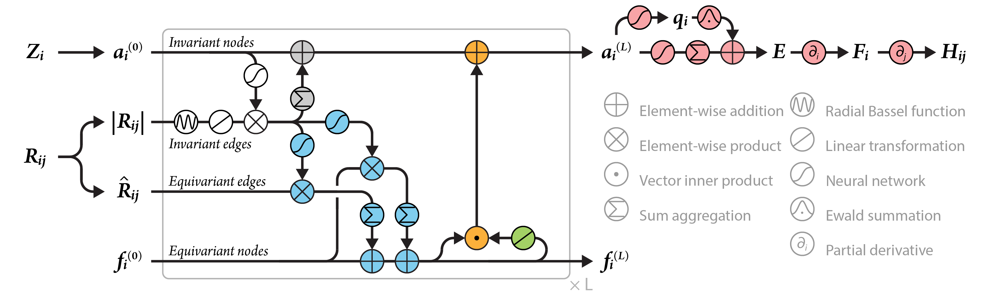

# NewtonNet

A Newtonian message passing network for deep learning of interatomic potentials and forces. https://doi.org/10.1039/D2DD00008C

## Abstract

We report a new deep learning message passing network that takes inspiration from Newton's equations of motion to learn interatomic potentials and forces. With the advantage of directional information from trainable force vectors, and physics-infused operators that are inspired by Newtonian physics, the entire model remains rotationally equivariant, and many-body interactions are inferred by more interpretable physical features. We test NewtonNet on the prediction of several reactive and non-reactive high quality ab initio data sets including single small molecules, a large set of chemically diverse molecules, and methane and hydrogen combustion reactions, achieving state-of-the-art test performance on energies and forces with far greater data and computational efficiency than other deep learning models.



## Datasets

MD17 Aspirin, from https://github.com/THGLab/NewtonNet/

| Dataset      | Train | Val | Test |
| :----------- | :---- | :-- | :--- |
| MD17 Aspirin | 950   | 50  | 500  |

## Results

<table>
    <head>
        <tr>
            <th  nowrap="nowrap">Model Name</th>
            <th  nowrap="nowrap">Dataset</th>
            <th  nowrap="nowrap">Epoch</th>
            <th  nowrap="nowrap">Loss</th>
        </tr>
    </head>
    <body>
        <tr>
            <td  nowrap="nowrap">NewtonNet</td>
            <td  nowrap="nowrap">MD17 Aspirin</td>
            <td  nowrap="nowrap">1</td>
            <td  nowrap="nowrap">62.082631</td>
        </tr>  
        <tr>
            <td  nowrap="nowrap">NewtonNet</td>
            <td  nowrap="nowrap">MD17 Aspirin</td>
            <td  nowrap="nowrap">2</td>
            <td  nowrap="nowrap">38.030187</td>
        </tr>  
        <tr>
            <td  nowrap="nowrap">NewtonNet</td>
            <td  nowrap="nowrap">MD17 Aspirin</td>
            <td  nowrap="nowrap">3</td>
            <td  nowrap="nowrap">20.835941</td>
        </tr>  
        <tr>
            <td  nowrap="nowrap">NewtonNet</td>
            <td  nowrap="nowrap">MD17 Aspirin</td>
            <td  nowrap="nowrap">4</td>
            <td  nowrap="nowrap">15.014843</td>
        </tr>  
        <tr>
            <td  nowrap="nowrap">NewtonNet</td>
            <td  nowrap="nowrap">MD17 Aspirin</td>
            <td  nowrap="nowrap">5</td>
            <td  nowrap="nowrap">12.943769</td>
        </tr>  
    </body>
</table>

### Training

```bash
cd interatomic_potentials
python train.py -c configs/newtonnet/newtonnet.yaml
```

### ### Validation

```bash
# Adjust program behavior on-the-fly using command-line parameters – this provides a convenient way to customize settings without modifying the configuration file directly.
# such as: --Global.do_eval=True

cd interatomic_potentials
python train.py -c configs/newtonnet/newtonnet.yaml Global.do_test=False Global.do_train=False Global.do_eval=True Trainer.pretrained_model_path='your checkpoint path(*.pdparams)'

```

### Testing

```bash
# This command is used to evaluate the model's performance on the test dataset.

cd interatomic_potentials
python train.py -c configs/newtonnet/newtonnet.yaml Global.do_test=True Global.do_train=False Global.do_eval=False Trainer.pretrained_model_path='your checkpoint path(*.pdparams)'

```

### Prediction

Prediction not used, the same to https://github.com/THGLab/NewtonNet/.
