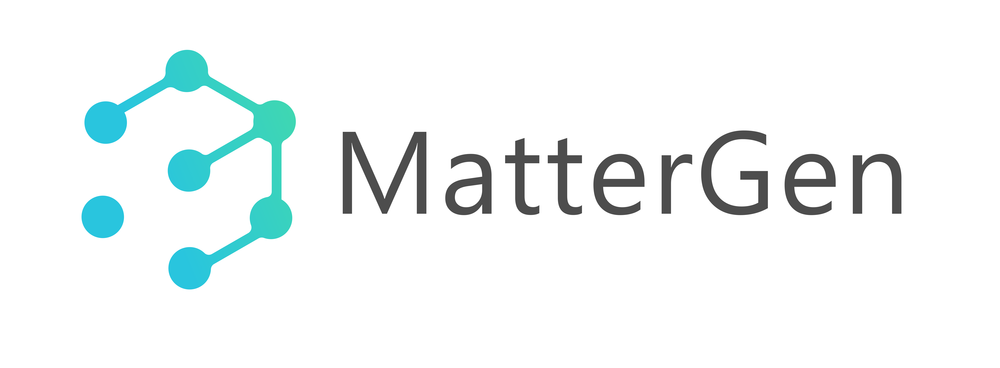
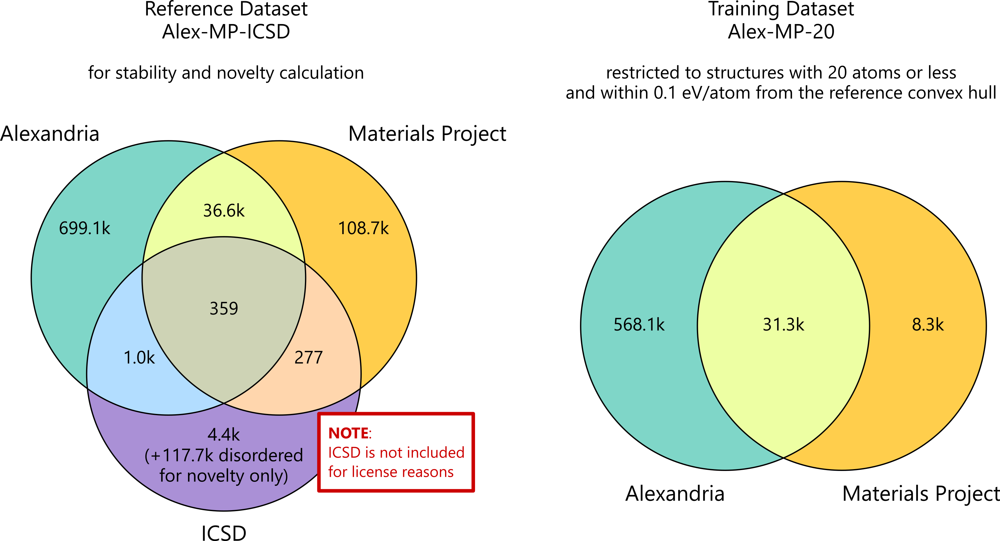

<h1>
<p align="center">
    
</p>
</h1>

<h4 align="center">

[](https://www.nature.com/articles/s41586-025-08628-5)
[](https://arxiv.org/abs/2312.03687)
[](https://python.org/downloads)
</h4>

MatterGen is a generative model for inorganic materials design across the periodic table that can be fine-tuned to steer the generation towards a wide range of property constraints.

This is a reimplementation of the original [MatterGen](https://github.com/microsoft/mattergen) repository using the [PaddlePaddle](https://www.paddlepaddle.org.cn/) framework.

The original [MatterGen](https://github.com/microsoft/mattergen) repositoryis licensed under the MIT license.

## Table of Contents
- [Table of Contents](#table-of-contents)
- [To-do List](#to-do-list)
- [Results on MP20](#results-on-mp20)
  - [Pretrain base model](#pretrain-base-model)
    - [Training](#training)
    - [Generation](#generation)
    - [Evaluation](#evaluation)
- [Installation](#installation)
- [Get started with a pre-trained model](#get-started-with-a-pre-trained-model)
- [Generating materials](#generating-materials)
  - [Unconditional generation](#unconditional-generation)
  - [Property-conditioned generation](#property-conditioned-generation)
  - [Multiple property-conditioned generation](#multiple-property-conditioned-generation)
- [Evaluation](#evaluation-1)
- [Train MatterGen yourself](#train-mattergen-yourself)
  - [Pre-process a dataset for training](#pre-process-a-dataset-for-training)
  - [Training](#training-1)
  - [Fine-tuning on property data](#fine-tuning-on-property-data)
    - [Multi-property fine-tuning](#multi-property-fine-tuning)
    - [Fine-tune on your own property data](#fine-tune-on-your-own-property-data)
- [Data release](#data-release)
  - [Training datasets](#training-datasets)
  - [Reference dataset](#reference-dataset)
- [Citation](#citation)
- [Responsible AI Transparency Documentation](#responsible-ai-transparency-documentation)


## To-do List
 + [x] Pretrain base model
   - [x] training
   - [x] generation
   - [x] evaluation
 + [x] Finetune with property constraints
   - [x] chemical_system
   - [x] space_group
   - [x] dft_mag_density 
   - [x] dft_band_gap
   - [x] ml_bulk_modulus 
   - [x] dft_mag_density_hhi_score
   - [x] chemical_system_energy_above_hull
   - [x] Multi-property fine-tuning


## Results on MP20
We train Mattergen from scratch on the `mp_20` dataset and subsequently finetune it with property constraints.

|                                       Base model                                        | Dataset | train(loss) | val(loss) |
| :-------------------------------------------------------------------------------------: | :-----: | :---------: | :-------: |
|                   [Original](https://github.com/microsoft/mattergen)                    | `mp_20` |   0.3484    |  0.3794   |
| [This repo](https://github.com/PaddlePaddle/PaddleMaterial/jointContribution/mattergen) | `mp_20` |   0.3459    |  0.3735   |


|                                     chemical_system                                     | Dataset | train(loss) | val(loss) |
| :-------------------------------------------------------------------------------------: | :-----: | :---------: | :-------: |
|                   [Original](https://github.com/microsoft/mattergen)                    | `mp_20` |   0.2761    |  0.3134   |
| [This repo](https://github.com/PaddlePaddle/PaddleMaterial/jointContribution/mattergen) | `mp_20` |   0.2803    |  0.3161   |

|                                      dft_band_gap                                       | Dataset | train(loss) | val(loss) |
| :-------------------------------------------------------------------------------------: | :-----: | :---------: | :-------: |
|                   [Original](https://github.com/microsoft/mattergen)                    | `mp_20` |   0.3194    |  0.3679   |
| [This repo](https://github.com/PaddlePaddle/PaddleMaterial/jointContribution/mattergen) | `mp_20` |   0.3057    |  0.3547   |

|                                     dft_mag_density                                     | Dataset | train(loss) | val(loss) |
| :-------------------------------------------------------------------------------------: | :-----: | :---------: | :-------: |
|                   [Original](https://github.com/microsoft/mattergen)                    | `mp_20` |   0.3211    |  0.3692   |
| [This repo](https://github.com/PaddlePaddle/PaddleMaterial/jointContribution/mattergen) | `mp_20` |   0.3112    |  0.3682   |


|                                    dft_bulk_modulus                                     | Dataset | train(loss) | val(loss) |
| :-------------------------------------------------------------------------------------: | :-----: | :---------: | :-------: |
|                   [Original](https://github.com/microsoft/mattergen)                    | `mp_20` |   0.2478    |  0.3039   |
| [This repo](https://github.com/PaddlePaddle/PaddleMaterial/jointContribution/mattergen) | `mp_20` |   0.2747    |  0.2931   |


### Pretrain base model

#### Training

```bash 
# single gpu
PYTHONPATH=$PWD HYDRA_FULL_ERROR=1 python scripts/run.py 
# multi gpu
PYTHONPATH=$PWD HYDRA_FULL_ERROR=1 python -m paddle.distributed.launch --gpus="0,1,2,3" scripts/run.py
```
Warning: The `total_batch_size` should be 128. It is calculated as `num_gpus * batch_size`. You can modify this setting in the `mp_20.yaml` file located at `PaddleMaterial/jointContribution/mattergen/mattergen/conf/data_module/`.

#### Generation

```bash
PYTHONPATH=$PWD python scripts/generate.py results_mp20/ outputs/xxx/xxx/output --batch_size=128 --num_batches 8
```

#### Evaluation
```bash
export RESULTS_PATH=results_mp20/generated_crystals_cif.zip
export RELAXED_PATH=results_mp20/generated_crystals_cif_relaxed.zip
export ENERGIES_PATH=results_mp20/generated_crystals_energies.npy
export SAVE_PATH=results_mp20

export PYTHONPATH=$PWD
python scripts/evaluate.py \
    --structures_path=$RESULTS_PATH  \
    --relaxed_structures_path=$RELAXED_PATH \
    --energies_path=$ENERGIES_PATH \
    --structure_matcher='disordered' \
    --save_as="$SAVE_PATH/metrics.json"
```


## Installation

1. Download this repository:
    ```bash
    git clone https://github.com/PaddlePaddle/PaddleMaterial.git
    cd jointContribution/mattergen
    ```

2. Create a new conda environment and activate it.
    ```bash
    conda create -n pp_mattergen python=3.10
    conda activate pp_mattergen
    ```

3. Install [PaddlePaddle](https://www.paddlepaddle.org.cn/install/quick?docurl=undefined) according to the commands on the official website. For example, if you are using a GPU with CUDA 11.8:
   ```bash
   python -m pip install paddlepaddle-gpu==3.0.0rc1 -i https://www.paddlepaddle.org.cn/packages/stable/cu118/
   ```
4. Install requirements:
    ```bash
    pip install -r requirements.txt
    ```
5. ~~Install [paddle_scatter](https://github.com/PFCCLab/paddle_scatter). (The code repository includes built-in paddle_scatter support, so installation is unnecessary.)~~
    

6. Due to the current incompatibility of PGL with the latest version of Paddle, it is necessary to modify some code within the installation path after installing PGL. The modification can be automatically completed through the following command:
    ```bash
    python fix_pgl.py
    ```
7. Finshed installation.


## Get started with a pre-trained model
We have converted the model weights provided in the original repository, which you can download from [here](https://pan.baidu.com/s/1YO1ZKUNvdU6xxP9GuI9p1g?pwd=u4t6).
* `mattergen_base`: unconditional base model
* `chemical_system`: fine-tuned model conditioned on chemical system
* `space_group`: fine-tuned model conditioned on space group
* `dft_mag_density`: fine-tuned model conditioned on magnetic density from DFT
* `dft_band_gap`: fine-tuned model conditioned on band gap from DFT
* `ml_bulk_modulus`: fine-tuned model conditioned on bulk modulus from ML predictor
* `dft_mag_density_hhi_score`: fine-tuned model jointly conditioned on magnetic density from DFT and HHI score
* `chemical_system_energy_above_hull`: fine-tuned model jointly conditioned on chemical system and energy above hull from DFT
* `**_mp20`: pretrained or fine-tuned model on the `mp_20` dataset.


## Generating materials
### Unconditional generation
To sample from the pre-trained base model, run the following command.
```bash
export MODEL_PATH=checkpoints/mattergen_base  # Or provide your own model
export RESULTS_PATH=results/  # Samples will be written to this directory
export PYTHONPATH=$PWD
# generate batch_size * num_batches samples
python scripts/generate.py $RESULTS_PATH $MODEL_PATH --batch_size=16 --num_batches 1
```
This script will write the following files into `$RESULTS_PATH`:
* `generated_crystals_cif.zip`: a ZIP file containing a single `.cif` file per generated structure.
* `generated_crystals.extxyz`, a single file containing the individual generated structures as frames.
* If `--record-trajectories == True` (default): `generated_trajectories.zip`: a ZIP file containing a `.extxyz` file per generated structure, which contains the full denoising trajectory for each individual structure.
> [!TIP]
> For best efficiency, increase the batch size to the largest your GPU can sustain without running out of memory.
### Property-conditioned generation
With a fine-tuned model, you can generate materials conditioned on a target property.
For example, to sample from the model trained on magnetic density, you can run the following command.
```bash
export MODEL_NAME=dft_mag_density
export MODEL_PATH="checkpoints/$MODEL_NAME"  # Or provide your own model
export RESULTS_PATH="results/$MODEL_NAME/"  # Samples will be written to this directory, e.g., `results/dft_mag_density`
export PYTHONPATH=$PWD
# Generate conditional samples with a target magnetic density of 0.15
python scripts/generate.py $RESULTS_PATH $MODEL_PATH --batch_size=16 --checkpoint_epoch=latest --properties_to_condition_on="{'dft_mag_density': 0.15}" --diffusion_guidance_factor=2.0
```

For a chemical system, you should use a hyphen ('-') to separate the components, such as:
```bash
export MODEL_NAME=chemical_system
export MODEL_PATH="checkpoints/$MODEL_NAME"  # Or provide your own model
export RESULTS_PATH="results/$MODEL_NAME/"  # Samples will be written to this directory, e.g., `results/chemical_system`
export PYTHONPATH=$PWD
python scripts/generate.py $RESULTS_PATH $MODEL_PATH --batch_size=16 --checkpoint_epoch=latest --properties_to_condition_on="{'chemical_system': 'Mo-Si'}" --diffusion_guidance_factor=2.0
```


> [!TIP]
> The argument `--diffusion-guidance-factor` corresponds to the $\gamma$ parameter in [classifier-free diffusion guidance](https://sander.ai/2022/05/26/guidance.html). Setting it to zero corresponds to unconditional generation, and increasing it further tends to produce samples which adhere more to the input property values, though at the expense of diversity and realism of samples.

### Multiple property-conditioned generation
You can also generate materials conditioned on more than one property. For instance, you can use the pre-trained model located at `checkpoints/chemical_system_energy_above_hull` to generate conditioned on chemical system and energy above the hull, or the model at `checkpoints/dft_mag_density_hhi_score` for joint conditioning on [HHI score](https://en.wikipedia.org/wiki/Herfindahl%E2%80%93Hirschman_index) and magnetic density.
Adapt the following command to your specific needs:
```bash
export MODEL_NAME=chemical_system_energy_above_hull
export MODEL_PATH="checkpoints/$MODEL_NAME"  # Or provide your own model
export RESULTS_PATH="results/$MODEL_NAME/"  # Samples will be written to this directory, e.g., `results/dft_mag_density`
export PYTHONPATH=$PWD
python scripts/generate.py $RESULTS_PATH $MODEL_PATH --batch_size=16 --checkpoint_epoch=latest --properties_to_condition_on="{'energy_above_hull': 0.05, 'chemical_system': 'Li-O'}" --diffusion_guidance_factor=2.0
```
## Evaluation

Once you have generated a list of structures contained in `$RESULTS_PATH` (either using MatterGen or another method), you can relax the structures and compute novelty, uniqueness, stability (using energy by DFT), and other metrics via the following command:

```bash
export RELAXED_PATH=your relaxed structures path/generated_crystals_cif_relaxed.zip
export ENERGIES_PATH=your relaxed structures energy path/generated_crystals_energies.npy

export PYTHONPATH=$PWD
python scripts/evaluate.py \
    --structures_path=$RESULTS_PATH/generated_crystals_cif.zip  \
    --relaxed_structures_path=$RELAXED_PATH \
    --energies_path=$ENERGIES_PATH \
    --structure_matcher='disordered' \
    --save_as="$RESULTS_PATH/metrics.json"
```

This script will write `metrics.json` containing the metric results to `$RESULTS_PATH` and will print it to your console.

Here, we expect `energies.npy` to be a numpy array with the entries being `float` energies in the same order as the structures read from `$RESULTS_PATH`.

## Train MatterGen yourself
Before we can train MatterGen from scratch, we have to unpack and preprocess the dataset files.

### Pre-process a dataset for training

You can run the following command for `mp_20`:
```bash
unzip data-release/mp-20/mp_20_chemical_system.zip -d datasets
PYTHONPATH=$PWD python scripts/csv_to_dataset.py --csv-folder datasets/mp_20/ --dataset-name mp_20_chemical_system --cache-folder datasets/cache
```
You will get preprocessed data files in `datasets/cache/mp_20`.

To preprocess our larger `alex_mp_20` dataset, run:
```bash
unzip data-release/alex-mp/alex_mp_20.zip -d datasets
PYTHONPATH=$PWD python scripts/csv_to_dataset.py --csv-folder datasets/alex_mp_20/ --dataset-name alex_mp_20 --cache-folder datasets/cache
```
This will take some time (~1h). You will get preprocessed data files in `datasets/cache/alex_mp_20`.

### Training


You can train the MatterGen base model on `mp_20` using the following command.

```bash 
# single gpu
PYTHONPATH=$PWD HYDRA_FULL_ERROR=1 python scripts/run.py 
# multi gpu
PYTHONPATH=$PWD HYDRA_FULL_ERROR=1 python -m paddle.distributed.launch --gpus="0,1,2,3" scripts/run.py
```
Warning: The `total_batch_size` should be 128. It is calculated as `num_gpus * batch_size`. You can modify this setting in the `mp_20.yaml` file located at `mattergen/conf/data_module/`.


The validation loss (`loss_val`) should reach 0.4 after 360 epochs (about 80k steps). The output checkpoints can be found at `outputs/singlerun/${now:%Y-%m-%d}/${now:%H-%M-%S}/output`. We call this folder `$MODEL_PATH` for future reference. 


To train the MatterGen base model on alex_mp_20, use the following command:
```bash 
# single gpu
PYTHONPATH=$PWD HYDRA_FULL_ERROR=1 python scripts/run.py data_module=alex_mp_20
# multi gpu
PYTHONPATH=$PWD HYDRA_FULL_ERROR=1 python -m paddle.distributed.launch --gpus="0,1,2,3" scripts/run.py data_module=alex_mp_20
```

Warning: The total_batch_size should be 512. It is calculated as num_gpus * batch_size. You can modify this setting in the alex_mp_20.yaml file located at mattergen/conf/data_module/.


> [!NOTE]
> We use [`hydra`](https://hydra.cc/docs/intro/) to configure our training and sampling jobs. The hierarchical configuration can be found under [`mattergen/conf`](mattergen/conf). In the following we make use of `hydra`'s config overrides to update these configs via the CLI. See the `hydra` [documentation](https://hydra.cc/docs/advanced/override_grammar/basic/) for an introduction to the config override syntax.

### Fine-tuning on property data

Assume that you have a MatterGen base model at `$MODEL_PATH` (e.g., `checkpoints/mattergen_base`). You can fine-tune MatterGen using the following command.

```bash
export PROPERTY=dft_mag_density
export MODEL_PATH=checkpoints/mattergen_base
export PYTHONPATH=$PWD
python scripts/finetune.py adapter.model_path=$MODEL_PATH data_module=mp_20 +lightning_module/diffusion_module/model/property_embeddings@adapter.adapter.property_embeddings_adapt.$PROPERTY=$PROPERTY data_module.properties=["$PROPERTY"]

```

`dft_mag_density` denotes the target property for fine-tuning. 

> [!TIP]
> You can select any property that is available in the dataset. See [`mattergen/conf/data_module/mp_20.yaml`](mattergen/conf/data_module/mp_20.yaml) or [`mattergen/conf/data_module/alex_mp_20.yaml`](mattergen/conf/data_module/alex_mp_20.yaml) for the list of supported properties. You can also add your own custom property data. See [below](#fine-tune-on-your-own-property-data) for instructions.

#### Multi-property fine-tuning

You can also fine-tune MatterGen on multiple properties. For instance, to fine-tune it on `chemical_system` and `energy_above_hull`, you can use the following command.

```bash
export PROPERTY1=chemical_system
export PROPERTY2=energy_above_hull 
export MODEL_PATH=checkpoints/mattergen_base
export PYTHONPATH=$PWD
# single gpu
python scripts/finetune.py adapter.model_path=$MODEL_PATH data_module=alex_mp_20 +lightning_module/diffusion_module/model/property_embeddings@adapter.adapter.property_embeddings_adapt.$PROPERTY1=$PROPERTY1 +lightning_module/diffusion_module/model/property_embeddings@adapter.adapter.property_embeddings_adapt.$PROPERTY2=$PROPERTY2 data_module.properties=["$PROPERTY1","$PROPERTY2"]
# multi gpu
python -m paddle.distributed.launch --gpus="1,2,3,4" scripts/finetune.py adapter.model_path=$MODEL_PATH data_module=alex_mp_20 +lightning_module/diffusion_module/model/property_embeddings@adapter.adapter.property_embeddings_adapt.$PROPERTY1=$PROPERTY1 +lightning_module/diffusion_module/model/property_embeddings@adapter.adapter.property_embeddings_adapt.$PROPERTY2=$PROPERTY2 data_module.properties=["$PROPERTY1","$PROPERTY2"]

```
> [!TIP]
> Add more properties analogously by adding these overrides:
> 1. `+lightning_module/diffusion_module/model/property_embeddings@adapter.adapter.property_embeddings_adapt.<my_property>=<my_property>`
> 2. Add `<my_property>` to the `data_module.properties=["$PROPERTY1", "$PROPERTY2", ..., <my_property>]` override.

#### Fine-tune on your own property data
You may also fine-tune MatterGen on your own property data. Essentially what you need is a property value (typically `float`) for a subset of the data you want to train on (e.g., `alex_mp_20`). Proceed as follows:
1. Add the name of your property to the `PROPERTY_SOURCE_IDS` list inside [`mattergen/mattergen/common/utils/globals.py`](mattergen/mattergen/common/utils/globals.py).
2. Add a new column with this name to the dataset(s) you want to train on, e.g., `datasets/alex_mp_20/train.csv` and `datasets/alex_mp_20/val.csv` (requires you to have followed the [pre-processing steps](#pre-process-a-dataset-for-training)).
3. Re-run the CSV to dataset script `python scripts/csv_to_dataset.py --csv-folder datasets/<MY_DATASET>/ --dataset-name <MY_DATASET> --cache-folder datasets/cache`, substituting your dataset name for `MY_DATASET`.
4. Add a `<your_property>.yaml` config file to [`mattergen/conf/lightning_module/diffusion_module/model/property_embeddings`](mattergen/conf/lightning_module/diffusion_module/model/property_embeddings). If you are adding a float-valued property, you may copy an existing configuration, e.g., [`dft_mag_density.yaml`](mattergen/conf/lightning_module/diffusion_module/model/property_embeddings/dft_mag_density.yaml). More complicated properties will require you to create your own custom `PropertyEmbedding` subclass, e.g., see the [`space_group`](mattergen/conf/lightning_module/diffusion_module/model/property_embeddings/space_group.yaml) or [`chemical_system`](mattergen/conf/lightning_module/diffusion_module/model/property_embeddings/chemical_system.yaml) configs.
5. Follow the [instructions for fine-tuning](#fine-tuning-on-property-data) and reference your own property in the same way as we used the existing properties like `dft_mag_density`.

## Data release
You can download the datasets for training and evaluating MatterGen from [here](https://pan.baidu.com/s/15yC8UUcMO6tJV6MiJOPYFA?pwd=z9k5) and save them to mattergen/data-release/alex-mp(mp-20) folder.For more details and license information see the respective README files under [`data-release`](data-release).
### Training datasets
* MP-20 ([Jain et al., 2013](https://pubs.aip.org/aip/apm/article/1/1/011002/119685)): contains 45k general inorganic materials, including most experimentally known materials with no more than 20 atoms in unit cell.
* Alex-MP-20: Training dataset consisting of around 600k structures from MP-20 and Alexandria ([Schmidt et al. 2022](https://archive.materialscloud.org/record/2022.126)) with at most 20 atoms inside the unit cell and below 0.1 eV/atom of the convex hull. See the venn diagram below and the MatterGen paper for more details.

### Reference dataset
Download the Alex-MP reference dataset from [here](https://pan.baidu.com/s/15yC8UUcMO6tJV6MiJOPYFA?pwd=z9k5) and save it to mattergen/data-release/alex-mp/ folder. This dataset can be used to evaluate novelty and stability of generated samples. 
The reference set contains 845,997 structures with their DFT energies. See the following Venn diagram for more details about the composition of the training and reference datasets.
> [!NOTE]
> We only share the 4.4k ordered + 117.7k disordered ICSD structures as the original repo.





## Citation
If you are using our code, model, data, or evaluation pipeline, please consider citing the work:
```bibtex
@article{MatterGen2025,
  author  = {Zeni, Claudio and Pinsler, Robert and Z{\"u}gner, Daniel and Fowler, Andrew and Horton, Matthew and Fu, Xiang and Wang, Zilong and Shysheya, Aliaksandra and Crabb{\'e}, Jonathan and Ueda, Shoko and Sordillo, Roberto and Sun, Lixin and Smith, Jake and Nguyen, Bichlien and Schulz, Hannes and Lewis, Sarah and Huang, Chin-Wei and Lu, Ziheng and Zhou, Yichi and Yang, Han and Hao, Hongxia and Li, Jielan and Yang, Chunlei and Li, Wenjie and Tomioka, Ryota and Xie, Tian},
  journal = {Nature},
  title   = {A generative model for inorganic materials design},
  year    = {2025},
  doi     = {10.1038/s41586-025-08628-5},
}
```


## Responsible AI Transparency Documentation

The responsible AI transparency documentation can be found [here](MODEL_CARD.md).


