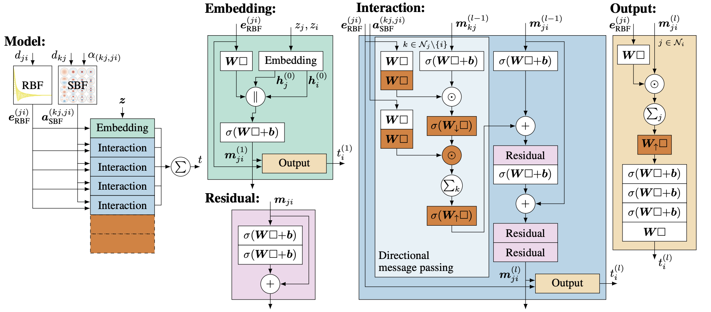

# DimeNet++

[Fast and Uncertainty-Aware Directional Message Passing for Non-Equilibrium Molecules](https://arxiv.org/abs/2011.14115)

## Abstract

Many important tasks in chemistry revolve around molecules during reactions. This requires predictions far from the equilibrium, while most recent work in machine learning for molecules has been focused on equilibrium or near-equilibrium states. In this paper we aim to extend this scope in three ways. First, we propose the DimeNet++ model, which is 8x faster and 10% more accurate than the original DimeNet on the QM9 benchmark of equilibrium molecules. Second, we validate DimeNet++ on highly reactive molecules by developing the challenging COLL dataset, which contains distorted configurations of small molecules during collisions. Finally, we investigate ensembling and mean-variance estimation for uncertainty quantification with the goal of accelerating the exploration of the vast space of non-equilibrium structures. Our DimeNet++ implementation as well as the COLL dataset are available online.




## Datasets:

- MP2018.6.1:

    The original dataset can download from [here](https://figshare.com/ndownloader/files/15087992). Following the methodology outlined in the Comformer paper, we randomly partitioned the dataset into subsets, with the specific sample sizes for each subset detailed in the table below.

    |                                   Dataset                                    | Train |  Val  | Test  |
    | :--------------------------------------------------------------------------: | :---: | :---: | :---: |
    | [mp2018_train_60k](https://paddle-org.bj.bcebos.com/paddlematerial/datasets/mp2018/mp2018_train_60k.zip) | 60000 | 5000  | 4239  |

## Results

<table>
    <head>
        <tr>
            <th  nowrap="nowrap">Model Name</th>
            <th  nowrap="nowrap">Dataset</th>
            <th  nowrap="nowrap">Property</th>
            <th  nowrap="nowrap">MAE(Val / Test dataset)</th>
            <th  nowrap="nowrap">GPUs</th>
            <th  nowrap="nowrap">Training time</th>
            <th  nowrap="nowrap">Config</th>
            <th  nowrap="nowrap">Checkpoint | Log</th>
        </tr>
    </head>
    <body>
        <tr>
            <td  nowrap="nowrap">dimenetpp_mp2018_train_60k_e_form</td>
            <td  nowrap="nowrap">mp2018_train_60k</td>
            <td  nowrap="nowrap">Form. Energy(eV/atom)</td>
            <td  nowrap="nowrap">0.030738 / 0.032307</td>
            <td  nowrap="nowrap">4</td>
            <td  nowrap="nowrap">19 hours 54 min</td>
            <td  nowrap="nowrap"><a href="dimenet++_mp2018_train_60k_e_form.yaml">dimenet++_mp2018_train_60k_e_form</a></td>
            <td  nowrap="nowrap"><a href="https://paddle-org.bj.bcebos.com/paddlematerial/checkpoints/property_prediction/dimenet%2B%2B/dimenetpp_mp2018_train_60k_e_form.zip">checkpoint | log</a></td>
        </tr>  
        <tr>
            <td  nowrap="nowrap">dimenetpp_mp2018_train_60k_band_gap</td>
            <td  nowrap="nowrap">mp2018_train_60k</td>
            <td  nowrap="nowrap">Band Gap(eV)</td>
            <td  nowrap="nowrap">0.270737 / 0.282961</td>
            <td  nowrap="nowrap">4</td>
            <td  nowrap="nowrap">23 hours</td>
            <td  nowrap="nowrap"><a href="dimenet++_mp2018_train_60k_band_gap.yaml">dimenet++_mp2018_train_60k_band_gap</a></td>
            <td  nowrap="nowrap"><a href="https://paddle-org.bj.bcebos.com/paddlematerial/checkpoints/property_prediction/dimenet%2B%2B/dimenetpp_mp2018_train_60k_band_gap.zip">checkpoint | log</a></td>
        </tr>  
        <tr>
            <td  nowrap="nowrap">dimenetpp_mp2018_train_60k_K</td>
            <td  nowrap="nowrap">mp2018_train_60k</td>
            <td  nowrap="nowrap">Bulk modulus(GPa)</td>
            <td  nowrap="nowrap">8.068773 / 7.031967</td>
            <td  nowrap="nowrap">4</td>
            <td  nowrap="nowrap">~1 hour 38 min</td>
            <td  nowrap="nowrap"><a href="dimenet++_mp2018_train_60k_K.yaml">dimenet++_mp2018_train_60k_k</a></td>
            <td  nowrap="nowrap"><a href="https://paddle-org.bj.bcebos.com/paddlematerial/checkpoints/property_prediction/dimenet%2B%2B/dimenetpp_mp2018_train_60k_K.zip">checkpoint | log</a></td>
        </tr>
        <tr>
            <td  nowrap="nowrap">dimenetpp_mp2018_train_60k_G</td>
            <td  nowrap="nowrap">mp2018_train_60k</td>
            <td  nowrap="nowrap">Shear modulus(GPa)</td>
            <td  nowrap="nowrap">8.083622 / 7.122238</td>
            <td  nowrap="nowrap">4</td>
            <td  nowrap="nowrap">~1 hour 38 min</td>
            <td  nowrap="nowrap"><a href="dimenet++_mp2018_train_60k_G.yaml">dimenet++_mp2018_train_60k_G</a></td>
            <td  nowrap="nowrap"><a href="https://paddle-org.bj.bcebos.com/paddlematerial/checkpoints/property_prediction/dimenet%2B%2B/dimenetpp_mp2018_train_60k_G.zip">checkpoint | log</a></td>
        </tr>
    </body>
</table>

### Training
```bash
# formation energy per atom
# multi-gpu training, we use 4 gpus here
python -m paddle.distributed.launch --gpus="0,1,2,3" property_prediction/train.py -c property_prediction/configs/dimenet++/dimenet++_mp2018_train_60k_e_form.yaml
# single-gpu training
python property_prediction/train.py -c property_prediction/configs/dimenet++/dimenet++_mp2018_train_60k_e_form.yaml

# band gap
# multi-gpu training, we use 4 gpus here
python -m paddle.distributed.launch --gpus="0,1,2,3" property_prediction/train.py -c property_prediction/configs/dimenet++/dimenet++_mp2018_train_60k_band_gap.yaml
# single-gpu training
python property_prediction/train.py -c property_prediction/configs/dimenet++/dimenet++_mp2018_train_60k_band_gap.yaml

# bulk modulus
# multi-gpu training, we use 4 gpus here
python -m paddle.distributed.launch --gpus="0,1,2,3" property_prediction/train.py -c property_prediction/configs/dimenet++/dimenet++_mp2018_train_60k_K.yaml
# single-gpu training
python property_prediction/train.py -c property_prediction/configs/dimenet++/dimenet++_mp2018_train_60k_K.yaml

# shear modulus
# multi-gpu training, we use 4 gpus here
python -m paddle.distributed.launch --gpus="0,1,2,3" property_prediction/train.py -c property_prediction/configs/dimenet++/dimenet++_mp2018_train_60k_G.yaml
# single-gpu training
python property_prediction/train.py -c property_prediction/configs/dimenet++/dimenet++_mp2018_train_60k_G.yaml
```

### Validation
```bash
# Adjust program behavior on-the-fly using command-line parameters – this provides a convenient way to customize settings without modifying the configuration file directly.
# such as: --Global.do_eval=True

# formation energy per atom
python property_prediction/train.py -c property_prediction/configs/dimenet++/dimenet++_mp2018_train_60k_e_form.yaml Global.do_eval=True Global.do_train=False Global.do_test=False Trainer.pretrained_model_path='your model path(*.pdparams)'

# band gap
python property_prediction/train.py -c property_prediction/configs/dimenet++/dimenet++_mp2018_train_60k_band_gap.yaml Global.do_eval=True Global.do_train=False Global.do_test=False Trainer.pretrained_model_path='your model path(*.pdparams)'

# bulk modulus
python property_prediction/train.py -c property_prediction/configs/dimenet++/dimenet++_mp2018_train_60k_K.yaml Global.do_eval=True Global.do_train=False Global.do_test=False Trainer.pretrained_model_path='your model path(*.pdparams)'

# shear modulus
python property_prediction/train.py -c property_prediction/configs/dimenet++/dimenet++_mp2018_train_60k_G.yaml Global.do_eval=True Global.do_train=False Global.do_test=False Trainer.pretrained_model_path='your model path(*.pdparams)'
```

### Testing
```bash
# This command is used to evaluate the model's performance on the test dataset.

# formation energy per atom
python property_prediction/train.py -c property_prediction/configs/dimenet++/dimenet++_mp2018_train_60k_e_form.yaml Global.do_test=True Global.do_train=False Global.do_eval=False Trainer.pretrained_model_path='your model path(*.pdparams)'

# band gap
python property_prediction/train.py -c property_prediction/configs/dimenet++/dimenet++_mp2018_train_60k_band_gap.yaml Global.do_test=True Global.do_train=False Global.do_eval=False Trainer.pretrained_model_path='your model path(*.pdparams)'

# bulk modulus
python property_prediction/train.py -c property_prediction/configs/dimenet++/dimenet++_mp2018_train_60k_K.yaml Global.do_test=True Global.do_train=False Global.do_eval=False Trainer.pretrained_model_path='your model path(*.pdparams)'

# shear modulus
python property_prediction/train.py -c property_prediction/configs/dimenet++/dimenet++_mp2018_train_60k_G.yaml Global.do_test=True Global.do_train=False Global.do_eval=False Trainer.pretrained_model_path='your model path(*.pdparams)'
```

### Prediction

You can replace the `--model_name` parameter at  `Mode 1` with other model names from the `results` table.

```bash
# This command is used to predict the properties of new crystal structures using a trained model.
# Note: The model_name and weights_name parameters are used to specify the pre-trained model and its corresponding weights. The cif_file_path parameter is used to specify the path to the CIF files for which properties need to be predicted.
# The prediction results will be saved in a CSV file specified by the save_path parameter. Default save_path is 'result.csv'.

# formation energy per atom

# Mode 1: Leverage a pre-trained machine learning model for crystal formation energy prediction. The implementation includes automated model download functionality, eliminating the need for manual configuration.
python property_prediction/predict.py --model_name='dimenet++_mp2018_train_60k_e_form' --cif_file_path='./property_prediction/example_data/cifs/'

# Mode2: Use a custom configuration file and checkpoint for crystal formation energy prediction. This approach allows for more flexibility and customization.
python property_prediction/predict.py --config_path='property_prediction/configs/dimenet++/dimenet++_mp2018_train_60k_e_form.yaml' --checkpoint_path='you_checkpoint_path.pdparams' --cif_file_path='./property_prediction/example_data/cifs/'


# band gap

# Mode 1: Leverage a pre-trained machine learning model for crystal band gap prediction. The implementation includes automated model download functionality, eliminating the need for manual configuration.
python property_prediction/predict.py --model_name='dimenet++_mp2018_train_60k_band_gap' --cif_file_path='./property_prediction/example_data/cifs/'

# Mode2: Use a custom configuration file and checkpoint for crystal band gap prediction. This approach allows for more flexibility and customization.
python property_prediction/predict.py --config_path='property_prediction/configs/dimenet++/dimenet++_mp2018_train_60k_band_gap.yaml' --checkpoint_path='you_checkpoint_path.pdparams' --cif_file_path='./property_prediction/example_data/cifs/'

# bulk modulus

# Mode 1: Leverage a pre-trained machine learning model for crystal bulk modulus prediction. The implementation includes automated model download functionality, eliminating the need for manual configuration.
python property_prediction/predict.py --model_name='dimenet++_mp2018_train_60k_K' --cif_file_path='./property_prediction/example_data/cifs/'

# Mode2: Use a custom configuration file and checkpoint for crystal bulk modulus prediction. This approach allows for more flexibility and customization.
python property_prediction/predict.py --config_path='property_prediction/configs/dimenet++/dimenet++_mp2018_train_60k_K.yaml' --checkpoint_path='you_checkpoint_path.pdparams' --cif_file_path='./property_prediction/example_data/cifs/'


# shear modulus

# Mode 1: Leverage a pre-trained machine learning model for crystal shear modulus prediction. The implementation includes automated model download functionality, eliminating the need for manual configuration.
python property_prediction/predict.py --model_name='dimenet++_mp2018_train_60k_G' --cif_file_path='./property_prediction/example_data/cifs/'

# Mode2: Use a custom configuration file and checkpoint for crystal shear modulus prediction. This approach allows for more flexibility and customization.
python property_prediction/predict.py --config_path='property_prediction/configs/dimenet++/dimenet++_mp2018_train_60k_G.yaml' --checkpoint_path='you_checkpoint_path.pdparams' --cif_file_path='./property_prediction/example_data/cifs/'
```


## Citation
```
@article{gasteiger2020fast,
  title={Fast and Uncertainty-Aware Directional Message Passing for Non-Equilibrium Molecules},
  author={Gasteiger, Johannes and Giri, Shankari and Margraf, Johannes T. and Günnemann, Stephan},
  journal={arXiv preprint arXiv:2011.14115},
  year={2020}
}
```
