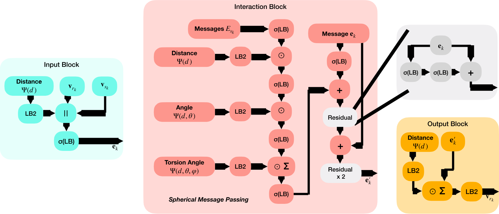

# SphereNet

[Spherical Message Passing for 3D Molecular Graphs](https://arxiv.org/abs/2102.05013) (ICLR 2021)

## Abstract

We propose the spherical message passing (SMP) scheme for 3D molecular graphs,
which leverages **distance, angle, and torsion** information simultaneously to
uniquely identify the relative positions of atoms in 3D space. Previous
methods such as SchNet (distance-only) and DimeNet++ (distance + angle) suffer
from equivariance ambiguity because multiple spatial configurations can map
to the same pairwise distances or angles. By incorporating torsion angles
(dihedral angles), SphereNet resolves this ambiguity and achieves
state-of-the-art results on the QM9 benchmark.

<p align="center">
  
  <br/>
  <em>Figure 1: SphereNet architecture.</em>
</p>

## Datasets

### QM9

The QM9 dataset contains 130,831 small organic molecules (up to 9 heavy
atoms: C, O, N, F) with 12 quantum-chemical properties computed at the
B3LYP/6-31G(2df,p) level of theory.

| Split   | Size   |
|---------|--------|
| Train   | 110,831 |
| Val     | 10,000  |
| Test    | 10,000  |
| **Total** | **130,831** |

**Data format**: Each molecule contains atomic numbers (`z`), 3D positions
(`pos`), and 12 property labels. The raw dataset is available at
[figshare](https://figshare.com/ndownloader/files/3195389).

**Reference**: [Quantum-chemical insights from deep learning](https://arxiv.org/abs/1708.04444) (Gaussian, 2017)

## Model

SphereNet is a spherical message passing neural network for 3D molecular
graphs. It represents each molecule as a graph where nodes correspond to
atoms, and directed edges encode interatomic interactions within a cutoff
radius. The model builds a hierarchy of geometric features and propagates
information using spherical message passing.

### Geometric embedding hierarchy

SphereNet constructs three levels of geometric embeddings to capture the
full 3D structure:

**1. Radial (distance) embeddings** — For each directed edge $j \to i$, the
interatomic distance $d_{ji}$ is expanded using a radial basis function
(RBF) composed with a smooth envelope.

**2. Angular (spherical) embeddings** — For each triplet $k \to j \to i$,
the bond angle $\theta_{kji}$ is expanded together with the distance
$d_{kj}$ using spherical Bessel functions combined with Legendre
polynomials (spherical Fourier-Bessel basis).

**3. Torsional embeddings** — For each quadruplet $l \to k \to j \to i$,
the torsion (dihedral) angle $\tau_{lkji}$ together with distances $d_{lk}$
and $d_{kj}$ is expanded using a 3D spherical Fourier-Bessel basis.

## Results

<table>
    <head>
        <tr>
            <th nowrap="nowrap">Model Name</th>
            <th nowrap="nowrap">Dataset</th>
            <th nowrap="nowrap">Property</th>
            <th nowrap="nowrap">MAE</th>
            <th nowrap="nowrap">GPUs</th>
            <th nowrap="nowrap">Training time</th>
            <th nowrap="nowrap">Config</th>
            <th nowrap="nowrap">Checkpoint | Log</th>
        </tr>
    </head>
    <body>
        <tr>
            <td nowrap="nowrap">spherenet_qm9_mu</td>
            <td nowrap="nowrap">QM9</td>
            <td nowrap="nowrap">$\mu$ (D)</td>
            <td nowrap="nowrap">0.032</td>
            <td nowrap="nowrap">1</td>
            <td nowrap="nowrap">~18 h</td>
            <td nowrap="nowrap"><a href="spherenet_qm9_mu.yaml">config</a></td>
            <td nowrap="nowrap"><a href="https://paddle-org.bj.bcebos.com/paddlematerials/checkpoints/property_prediction/spherenet/spherenet_qm9_mu.zip">checkpoint | log</a></td>
        </tr>
        <tr>
            <td nowrap="nowrap">spherenet_qm9_alpha</td>
            <td nowrap="nowrap">QM9</td>
            <td nowrap="nowrap">$\alpha$ (Bohr³)</td>
            <td nowrap="nowrap">0.24</td>
            <td nowrap="nowrap">1</td>
            <td nowrap="nowrap">~24 h</td>
            <td nowrap="nowrap"><a href="spherenet_qm9_alpha.yaml">config</a></td>
            <td nowrap="nowrap"><a href="https://paddle-org.bj.bcebos.com/paddlematerials/checkpoints/property_prediction/spherenet/spherenet_qm9_alpha.zip">checkpoint | log</a></td>
        </tr>
        <tr>
            <td nowrap="nowrap">spherenet_qm9_homo</td>
            <td nowrap="nowrap">QM9</td>
            <td nowrap="nowrap">$\varepsilon_{\text{HOMO}}$ (meV)</td>
            <td nowrap="nowrap">42</td>
            <td nowrap="nowrap">1</td>
            <td nowrap="nowrap">~22 h</td>
            <td nowrap="nowrap"><a href="spherenet_qm9_homo.yaml">config</a></td>
            <td nowrap="nowrap"><a href="https://paddle-org.bj.bcebos.com/paddlematerials/checkpoints/property_prediction/spherenet/spherenet_qm9_homo.zip">checkpoint | log</a></td>
        </tr>
        <tr>
            <td nowrap="nowrap">spherenet_qm9_lumo</td>
            <td nowrap="nowrap">QM9</td>
            <td nowrap="nowrap">$\varepsilon_{\text{LUMO}}$ (meV)</td>
            <td nowrap="nowrap">43</td>
            <td nowrap="nowrap">1</td>
            <td nowrap="nowrap">~22 h</td>
            <td nowrap="nowrap"><a href="spherenet_qm9_lumo.yaml">config</a></td>
            <td nowrap="nowrap"><a href="https://paddle-org.bj.bcebos.com/paddlematerials/checkpoints/property_prediction/spherenet/spherenet_qm9_lumo.zip">checkpoint | log</a></td>
        </tr>
        <tr>
            <td nowrap="nowrap">spherenet_qm9_gap</td>
            <td nowrap="nowrap">QM9</td>
            <td nowrap="nowrap">$\Delta\varepsilon$ (meV)</td>
            <td nowrap="nowrap">62</td>
            <td nowrap="nowrap">1</td>
            <td nowrap="nowrap">~22 h</td>
            <td nowrap="nowrap"><a href="spherenet_qm9_gap.yaml">config</a></td>
            <td nowrap="nowrap"><a href="https://paddle-org.bj.bcebos.com/paddlematerials/checkpoints/property_prediction/spherenet/spherenet_qm9_gap.zip">checkpoint | log</a></td>
        </tr>
        <tr>
            <td nowrap="nowrap">spherenet_qm9_r2</td>
            <td nowrap="nowrap">QM9</td>
            <td nowrap="nowrap">$\langle R^2 \rangle$ (Bohr²)</td>
            <td nowrap="nowrap">0.30</td>
            <td nowrap="nowrap">1</td>
            <td nowrap="nowrap">~12 h</td>
            <td nowrap="nowrap"><a href="spherenet_qm9_r2.yaml">config</a></td>
            <td nowrap="nowrap"><a href="https://paddle-org.bj.bcebos.com/paddlematerials/checkpoints/property_prediction/spherenet/spherenet_qm9_r2.zip">checkpoint | log</a></td>
        </tr>
        <tr>
            <td nowrap="nowrap">spherenet_qm9_zpve</td>
            <td nowrap="nowrap">QM9</td>
            <td nowrap="nowrap">ZPVE (meV)</td>
            <td nowrap="nowrap">1.4</td>
            <td nowrap="nowrap">1</td>
            <td nowrap="nowrap">~14 h</td>
            <td nowrap="nowrap"><a href="spherenet_qm9_zpve.yaml">config</a></td>
            <td nowrap="nowrap"><a href="https://paddle-org.bj.bcebos.com/paddlematerials/checkpoints/property_prediction/spherenet/spherenet_qm9_zpve.zip">checkpoint | log</a></td>
        </tr>
        <tr>
            <td nowrap="nowrap">spherenet_qm9_U0</td>
            <td nowrap="nowrap">QM9</td>
            <td nowrap="nowrap">$U_0$ (meV)</td>
            <td nowrap="nowrap">22</td>
            <td nowrap="nowrap">1</td>
            <td nowrap="nowrap">~20 h</td>
            <td nowrap="nowrap"><a href="spherenet_qm9_U0.yaml">config</a></td>
            <td nowrap="nowrap"><a href="https://paddle-org.bj.bcebos.com/paddlematerials/checkpoints/property_prediction/spherenet/spherenet_qm9_U0.zip">checkpoint | log</a></td>
        </tr>
        <tr>
            <td nowrap="nowrap">spherenet_qm9_U</td>
            <td nowrap="nowrap">QM9</td>
            <td nowrap="nowrap">$U$ (meV)</td>
            <td nowrap="nowrap">22</td>
            <td nowrap="nowrap">1</td>
            <td nowrap="nowrap">~20 h</td>
            <td nowrap="nowrap"><a href="spherenet_qm9_U.yaml">config</a></td>
            <td nowrap="nowrap"><a href="https://paddle-org.bj.bcebos.com/paddlematerials/checkpoints/property_prediction/spherenet/spherenet_qm9_U.zip">checkpoint | log</a></td>
        </tr>
        <tr>
            <td nowrap="nowrap">spherenet_qm9_H</td>
            <td nowrap="nowrap">QM9</td>
            <td nowrap="nowrap">$H$ (meV)</td>
            <td nowrap="nowrap">22</td>
            <td nowrap="nowrap">1</td>
            <td nowrap="nowrap">~20 h</td>
            <td nowrap="nowrap"><a href="spherenet_qm9_H.yaml">config</a></td>
            <td nowrap="nowrap"><a href="https://paddle-org.bj.bcebos.com/paddlematerials/checkpoints/property_prediction/spherenet/spherenet_qm9_H.zip">checkpoint | log</a></td>
        </tr>
        <tr>
            <td nowrap="nowrap">spherenet_qm9_G</td>
            <td nowrap="nowrap">QM9</td>
            <td nowrap="nowrap">$G$ (meV)</td>
            <td nowrap="nowrap">22</td>
            <td nowrap="nowrap">1</td>
            <td nowrap="nowrap">~20 h</td>
            <td nowrap="nowrap"><a href="spherenet_qm9_G.yaml">config</a></td>
            <td nowrap="nowrap"><a href="https://paddle-org.bj.bcebos.com/paddlematerials/checkpoints/property_prediction/spherenet/spherenet_qm9_G.zip">checkpoint | log</a></td>
        </tr>
        <tr>
            <td nowrap="nowrap">spherenet_qm9_Cv</td>
            <td nowrap="nowrap">QM9</td>
            <td nowrap="nowrap">$C_v$ (cal/(mol·K))</td>
            <td nowrap="nowrap">0.052</td>
            <td nowrap="nowrap">1</td>
            <td nowrap="nowrap">~18 h</td>
            <td nowrap="nowrap"><a href="spherenet_qm9_Cv.yaml">config</a></td>
            <td nowrap="nowrap"><a href="https://paddle-org.bj.bcebos.com/paddlematerials/checkpoints/property_prediction/spherenet/spherenet_qm9_Cv.zip">checkpoint | log</a></td>
        </tr>
    </body>
</table>

### Training

```bash
# Single-GPU training — QM9 mu property
python property_prediction/train.py \
  -c property_prediction/configs/spherenet/spherenet_qm9_mu.yaml
```

### Validation

```bash
python property_prediction/train.py \
  -c property_prediction/configs/spherenet/spherenet_qm9_mu.yaml \
  Global.do_eval=True Global.do_train=False Global.do_test=False \
  Trainer.pretrained_model_path='your_model.pdparams'
```

### Testing

```bash
python property_prediction/train.py \
  -c property_prediction/configs/spherenet/spherenet_qm9_mu.yaml \
  Global.do_test=True Global.do_train=False Global.do_eval=False \
  Trainer.pretrained_model_path='your_model.pdparams'
```

### Prediction

```bash
# Using a registered QM9 model
python property_prediction/predict.py \
  --model_name spherenet_qm9_mu \
  --xyz_file_path ./property_prediction/example_data/molecules/isoguvacine.xyz \
  --save_path ./output/spherenet_qm9_mu_prediction.csv

# Using a local checkpoint
python property_prediction/predict.py \
  --config_path ./property_prediction/configs/spherenet/spherenet_qm9_mu.yaml \
  --checkpoint_path ./output/spherenet_qm9_mu_t_*/checkpoints/best.pdparams \
  --xyz_file_path ./property_prediction/example_data/molecules/isoguvacine.xyz \
  --save_path ./output/spherenet_qm9_mu_prediction.csv
```

## Citation

```bibtex
@inproceedings{liu2021spherenet,
  title={Spherical Message Passing for 3D Molecular Graphs},
  author={Liu, Yi and Wang, Limei and Liu, Meng and Lin, Yuchao and Zhang, Xuan and
          Oztekin, Bora and Ji, Shuiwang},
  booktitle={International Conference on Learning Representations (ICLR)},
  year={2021}
}
```
