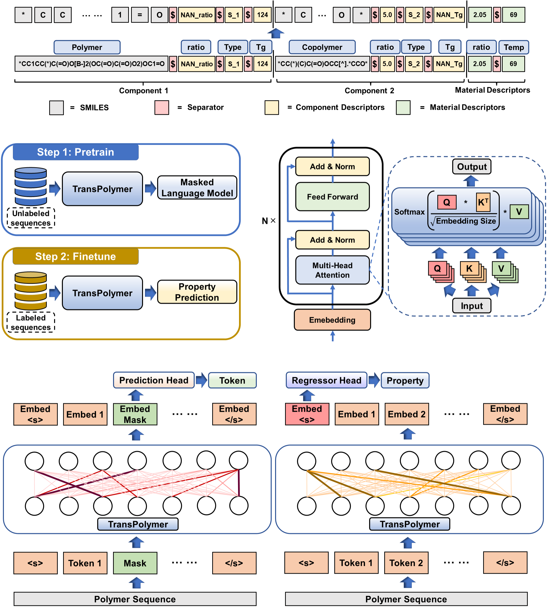

# TransPolymer

TransPolymer: a Transformer-based language model for polymer property predictions

## Abstract

TransPolymer is a RoBERTa-style language model designed for polymer sequence
representation learning and downstream polymer property prediction. It tokenizes
polymer SMILES strings with a chemistry-aware tokenizer, encodes them with a
pretrained Transformer backbone, and finetunes a regression head for target
properties such as polymer electrolyte conductivity.



Reference implementation: https://github.com/ChangwenXu98/TransPolymer

## Datasets:

The PE-I benchmark is used for polymer electrolyte conductivity prediction.

| Dataset | Train | Test | Property | Artifact |
| :---: | :---: | :---: | :---: | :---: |
| PE-I | 34803 | 146 | Conductivity [S/cm] | [download](https://pan.baidu.com/s/1AcCpPFrUeRgBb-Gv_sCYYg) (code: 1227) |

Download the artifact package and extract it to the PaddleMaterials root
directory. After extraction, the directory structure should be:

```text
PaddleMaterials/
|-- data/
|   |-- train_PE_I.csv
|   |-- test_PE_I.csv
|   `-- vocab/
|       `-- vocab_sup_PE_I.csv
|-- ckpt/
|   `-- pretrain.pt/
|       |-- config.json
|       `-- model_state.pdparams
`-- output/
    |-- PE_I_best_model.pdparams
    |-- PE_I_train.pdparams
    |-- transpolymer_pe_i_train.log
    `-- config_finetune.yaml
```

The training config uses the relative paths `./data/train_PE_I.csv`,
`./data/test_PE_I.csv`, `./data/vocab/vocab_sup_PE_I.csv`, and
`./ckpt/pretrain.pt`. The `output/` directory contains the finetuned checkpoint
and training log for reference.

## Model

TransPolymer uses a polymer-specific SMILES tokenizer and a RoBERTa-style
Transformer encoder. The converted Paddle pretraining checkpoint is loaded as the
backbone, and a lightweight regression head is finetuned for PE-I conductivity
prediction. Tokenization and model input construction are handled inside the
model, while the dataset only loads raw SMILES strings and property labels.

## Training

Run from PaddleMaterials root:

```bash
python property_prediction/train.py \
  -c property_prediction/configs/transpolymer/transpolymer_pe_i_finetune.yaml
```

## Configuration

Key options are defined in `transpolymer_pe_i_finetune.yaml`:

- `Dataset.*.dataset.__init_params__.path`: PE-I CSV file path.
- `Model.__init_params__.blocksize`: maximum sequence length after tokenization.
- `Model.__init_params__.vocab_sup_file`: supplementary PE-I vocabulary file.
- `Model.__init_params__.pretrained_model_path`: converted Paddle checkpoint directory.
- `Optimizer.lr.__init_params__.learning_rate`: finetuning learning rate.
- `Trainer.max_epochs`: maximum finetuning epochs.

## Results

<table>
    <head>
        <tr>
            <th nowrap="nowrap">Model Name</th>
            <th nowrap="nowrap">Dataset</th>
            <th nowrap="nowrap">Property</th>
            <th nowrap="nowrap">RMSE / R2(Test dataset)</th>
            <th nowrap="nowrap">GPUs</th>
            <th nowrap="nowrap">Training time</th>
            <th nowrap="nowrap">Config</th>
            <th nowrap="nowrap">Checkpoint | Log</th>
        </tr>
    </head>
    <body>
        <tr>
            <td nowrap="nowrap">transpolymer_pe_i_finetune</td>
            <td nowrap="nowrap">PE-I</td>
            <td nowrap="nowrap">Conductivity [S/cm]</td>
            <td nowrap="nowrap">0.8993 / 0.4508</td>
            <td nowrap="nowrap">1</td>
            <td nowrap="nowrap">~3 hours</td>
            <td nowrap="nowrap"><a href="transpolymer_pe_i_finetune.yaml">transpolymer_pe_i_finetune</a></td>
            <td nowrap="nowrap"><a href="https://pan.baidu.com/s/1AcCpPFrUeRgBb-Gv_sCYYg">checkpoint | log</a> (code: 1227)</td>
        </tr>
    </body>
</table>
