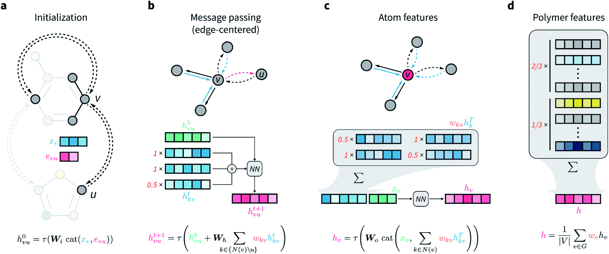

# wD-MPNN

[A graph representation of molecular ensembles for polymer property prediction](https://pubs.rsc.org/en/content/articlelanding/2022/SC/D2SC02839E)

## Abstract

Synthetic polymers are versatile and widely used materials. Similar to small organic molecules, a large chemical space of such materials is hypothetically accessible. Computational property prediction and virtual screening can accelerate polymer design by prioritizing candidates expected to have favorable properties. However, in contrast to organic molecules, polymers are often not well-defined single structures but a distribution over an ensemble of related structures, giving rise to additional challenges in property prediction. The authors introduce a graph representation of molecular ensembles and an associated weighted directed message passing neural network (wD-MPNN) that is tailored to the prediction of polymer properties. Beyond polymers, the proposed representation and model can be applied to any molecular system describable as a Markov chain over chemically distinct fragments, including copolymers, mixtures, and other stochastic molecular ensembles.



## Datasets

We demonstrate the wD-MPNN implementation on two widely used MoleculeNet small-molecule benchmarks. Each dataset is provided as a CSV file containing a SMILES column and a target column, and is consumed directly by `WDMPNNDataset`.

- BACE

    The BACE dataset provides quantitative binding results (binary class labels) for a set of inhibitors of human β-secretase 1 (BACE-1). It is a standard binary-classification benchmark from MoleculeNet.

    | Dataset | Count | SMILES Column | Target Column | Task Type |
    | :---: | :---: | :---: | :---: | :---: |
    | bace.csv | 1513 | `mol` | `Class` | Classification |

- Delaney (ESOL)

    The Delaney (ESOL) dataset reports measured aqueous solubility (log mol/L) for a set of small organic molecules. It is a standard regression benchmark from MoleculeNet.

    | Dataset | Count | SMILES Column | Target Column | Task Type |
    | :---: | :---: | :---: | :---: | :---: |
    | delaney.csv | 1128 | `smiles` | `logSolubility` | Regression |

The CSV files used in the configs (`./data/bace.csv` and `./data/delaney.csv`) follow the format used by the original Chemprop release.

## Model

The wD-MPNN extends the directed message passing neural network (D-MPNN) of Chemprop to molecular ensembles. A molecule (or molecular ensemble) is represented as a graph with atom features `f_v` and bond features `f_{vw}`. Messages are passed along **directed edges** rather than nodes: each directed edge `(v → w)` carries a hidden state `h_{vw}^t` that is iteratively updated by aggregating incoming messages from neighbors of `v`, while explicitly excluding the reverse edge `(w → v)` to avoid trivial back-and-forth message loops.

### Edge initialization

Each directed edge is first embedded by concatenating the atom and bond features and applying an input transformation:

```math
h_{vw}^{0} = \tau\!\left( W_i \, [\, f_v \,\Vert\, f_{vw} \,] \right)
```

where `W_i` is a learnable weight matrix and `τ` is a non-linear activation (ReLU by default).

### Directed message passing

For each step `t = 1, ..., T`, the hidden state of every directed edge is updated based on the messages of incoming directed edges, excluding the reverse edge:

```math
m_{vw}^{t+1} = \sum_{k \in \mathcal{N}(v) \setminus \{w\}} h_{kv}^{t}
```

```math
h_{vw}^{t+1} = \tau\!\left( h_{vw}^{0} + W_h \, m_{vw}^{t+1} \right)
```

where `W_h` is a shared weight matrix across all message-passing steps, providing an efficient parameter sharing scheme.

### Readout

After `T` message-passing steps, atom-level hidden states are obtained by aggregating the incoming directed edges, and the molecule-level representation is produced by a permutation-invariant pooling over atoms (mean by default, with `sum`/`norm` also supported through the `aggregation` option):

```math
h_v = \tau\!\left( W_o \, [\, f_v \,\Vert\, \sum_{k \in \mathcal{N}(v)} h_{kv}^{T} \,] \right)
```

```math
h_{\mathrm{mol}} = \mathrm{Aggregate}\!\left( \{ h_v : v \in \mathcal{V} \} \right)
```

The molecule-level vector `h_{mol}` is then fed into a feed-forward network (MLP) of `ffn_num_layers` layers with hidden size `ffn_hidden_size` to produce the final prediction. For regression targets a linear output is used; for classification a sigmoid (binary) or softmax (multiclass) is applied through the loss.

### Weighted ensembles for polymers

For polymer ensembles, every node and edge of the molecular graph carries an additional weight reflecting the stoichiometric ratio of the corresponding monomer (and an analogous weight is used for inter-monomer bonds reflecting the transition probability between fragments in the Markov-chain representation). Messages and atom-level features are then accumulated using these weights, so that the resulting molecule-level descriptor reflects the full ensemble. When weights are uniform, the model reduces to a standard D-MPNN, which is the regime exercised by the small-molecule benchmarks above.

The reference implementation in `ppmat/models/wd_mpnn/` consists of:

- `featurization.py` — RDKit-based atom/bond featurization and `BatchMolGraph` construction.
- `nn_utils.py` — activation factory, weight initialization, and tensor utilities such as `index_select_ND`.
- `wd_mpnn.py` — the `MPNEncoder` (directed message passing) and the top-level `WDMPNN` model wrapping the encoder with the readout MLP.

## Results

<table>
    <head>
        <tr>
            <th  nowrap="nowrap">Model Name</th>
            <th  nowrap="nowrap">Dataset</th>
            <th  nowrap="nowrap">Property</th>
            <th  nowrap="nowrap">Metric(Val / Test dataset)</th>
            <th  nowrap="nowrap">GPUs</th>
            <th  nowrap="nowrap">Training time</th>
            <th  nowrap="nowrap">Config</th>
            <th  nowrap="nowrap">Checkpoint | Log</th>
        </tr>
    </head>
    <body>
        <tr>
            <td  nowrap="nowrap">wd_mpnn_bace</td>
            <td  nowrap="nowrap">bace</td>
            <td  nowrap="nowrap">Class (AUC)</td>
            <td  nowrap="nowrap"> 0.947962 </td>
            <td  nowrap="nowrap"> 1 </td>
            <td  nowrap="nowrap"> ~10min </td>
            <td  nowrap="nowrap"><a href="wd_mpnn_bace.yaml">wd_mpnn_bace</a></td>
            <td  nowrap="nowrap"><a href="-">checkpoint | log</a></td>
        </tr>
        <tr>
            <td  nowrap="nowrap">wd_mpnn_delaney</td>
            <td  nowrap="nowrap">delaney</td>
            <td  nowrap="nowrap">logSolubility (MSE)</td>
            <td  nowrap="nowrap"> 0.261825* </td>
            <td  nowrap="nowrap"> 1 </td>
            <td  nowrap="nowrap"> ~4min </td>
            <td  nowrap="nowrap"><a href="wd_mpnn_delaney.yaml">wd_mpnn_delaney</a></td>
            <td  nowrap="nowrap"><a href="-">checkpoint | log</a></td>
        </tr>
    </body>
</table>

> *NOTE: The loss can be converted by `MSE_chemprop = MSE_PaddleMaterials / std^2` which is used in `polymer-chemprop`.

### Training
```bash
# BACE (classification)
# multi-gpu training, e.g. 4 gpus
python -m paddle.distributed.launch --gpus="0,1,2,3" property_prediction/train.py -c property_prediction/configs/wd_mpnn/wd_mpnn_bace.yaml
# single-gpu training
python property_prediction/train.py -c property_prediction/configs/wd_mpnn/wd_mpnn_bace.yaml

# Delaney / ESOL (regression)
python property_prediction/train.py -c property_prediction/configs/wd_mpnn/wd_mpnn_delaney.yaml
```

### Validation
```bash
# Run model evaluation on the validation dataset.
# Trainer.pretrained_model_path specifies the path to the saved model checkpoint to be loaded.

# BACE
python property_prediction/train.py \
    -c property_prediction/configs/wd_mpnn/wd_mpnn_bace.yaml \
    Global.do_train=False \
    Global.do_eval=True \
    Global.do_test=False \
    Trainer.pretrained_model_path=output/wd_mpnn_bace/checkpoints
```

### Testing
```bash
# Evaluate the model on the test dataset.

# Delaney
python property_prediction/train.py \
    -c property_prediction/configs/wd_mpnn/wd_mpnn_delaney.yaml \
    Global.do_train=False \
    Global.do_test=True \
    Global.do_eval=False \
    Trainer.pretrained_model_path=output/wd_mpnn_delaney/checkpoints
```

### Prediction

```bash
# Use a custom configuration file and checkpoint to predict molecular properties from a CSV of SMILES.
python property_prediction/predict.py \
    --config_path='property_prediction/configs/wd_mpnn/wd_mpnn_delaney.yaml' \
    --checkpoint_path='your_checkpoint_path.pdparams'
```


## Citation
```
@article{aldeghi2022graph,
  title={A graph representation of molecular ensembles for polymer property prediction},
  author={Aldeghi, Matteo and Coley, Connor W.},
  journal={Chemical Science},
  volume={13},
  number={35},
  pages={10486--10498},
  year={2022},
  publisher={Royal Society of Chemistry},
  doi={10.1039/D2SC02839E}
}
```
