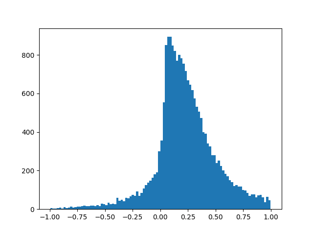
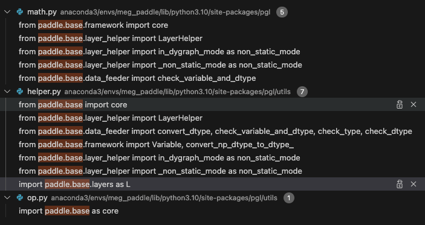

# PaddlePaddle for Materials

## 基于GNN的二维材料稳定性预测

### 整体流程（MegNet）

通过预测输入晶体的形成能（分解能等）等能量，实现晶体的稳定性预测，能量越低，稳定性越高。整体流程如下，网络模型输入为晶体的属性包括：原子类型、原子坐标、晶格常数等，网络模型输出为预测的晶体的形成能。涉及到：
1. 晶体数据的图结构表示；
2. GNN网络结构；
3. 预测稳定性；

    

详见文档3.4节：https://365.kdocs.cn/l/cmMI44AGmqJG

#### 二维材料数据

数据地址：https://365.kdocs.cn/ent/664860898/2340801472/304878020292

下图为二维材料数据凸包能的直方图，横坐标为凸包能，纵坐标为频数。

    

二维材料数据转换为Graph结构，其中节点为材料原子类型，边为两个节点之间的距离。

### 环境准备
    python==3.10.9
    paddlepaddle==2.6.1
    pgl==2.2.3
    pymatgen==2024.6.10

#### 新建环境：
    conda create -n test_env python=3.10.9
    conda activate test_env

#### 安装所需依赖包：
    pip install -r requirments.txt

由于PGL暂不兼容最新版本的Paddle，因此安装完成PGL后需要在安装路径内修改部分代码：
例如我的安装路径为：anaconda3/envs/meg_paddle/lib/python3.10/site-packages/pgl

1. 代码fluid替换为base:

    a. 将pgl下所有文件中的 paddle.fluid 替换为 paddle.base

    b. 将 paddle.base.core as core 替换为 paddle.base as core

    该部分会涉及到3个文件的改动，修改后如下：
    

2. 删除"overwrite"参数：
    在pgl/utils/helper.py中，将第109行 'overwrite' 参数删除，如下所示：

        if non_static_mode():
        # return _C_ops.scatter(x, index, updates, 'overwrite', overwrite)
        return _C_ops.scatter(x, index, updates, overwrite)

### 模型训练

    cd stability_prediction
    # 单卡训练
    python main.py
    # 多卡训练
    python -m paddle.distributed.launch --gpus="2,3,4,5" main.py

### 模型评估

    # 修改配置文件 configs/megnet_2d.yaml 里的 model/pretrained 字段为训练好的模型路径
    #   model:
    #        ...
    #        pretrained: './weights/megnet_2d_dp0.5/best.pdparams'
    cd stability_prediction
    python main.py --mode=test

### 二维材料训练
超参数详见: [megnet_2d.yaml](configs/megnet_2d.yaml)

实验结果：

    train_loss: 0.018
    val_loss: 0.049
    train_mae: 0.099
    val_mae: 0.145

    test_mae: 0.142

### 三维材料训练-MP
超参数详见: [megnet_3d_pretrain.yaml](configs/megnet_3d_pretrain.yaml)

实验结果：(best model)

    train_loss: 0.000449
    val_loss: 0.017095
    train_mae: 0.022108
    val_mae: 0.057668

    test_mae: 0.057356
