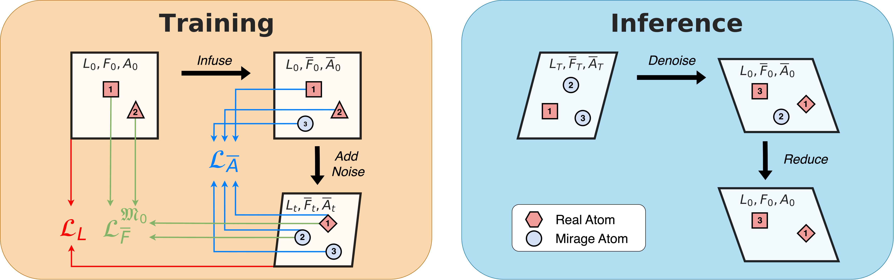

# MiAD

[Mirage Atom Diffusion for De Novo Crystal Generation](https://arxiv.org/abs/2511.14426)

## Abstract

MiAD introduces Mirage Infusion, a mechanism that allows diffusion models to dynamically adjust the number of atoms in a crystal structure during the generation trajectory. By treating a variable number of atoms as "mirage" atoms (sentinel states), MiAD achieves state-of-the-art performance in generating stable, unique, and novel (S.U.N.) materials. It uses DiffCsp as the backbone denoising architecture.




---

## Model Description

### Overview

A crystal is represented by three components within its unit cell:
- atom types: $A = (a_1,\ldots,a_N)$
- fractional coordinates: $F = (f_1,\ldots,f_N),\; f_i \in [0,1)^3$
- lattice matrix: $L \in \mathbb{R}^{3 \times 3}$

MiAD defines separate forward corruption processes for $(L, F, A)$ and trains a CSPNet-based denoiser to reverse them. During sampling, mirage atoms (type 0) can be transformed into real elements or discarded, allowing the model to adjust atom counts dynamically.

### Method

#### 1) Lattice diffusion

The lattice is diffused with a standard DDPM Gaussian process. Supports Flow Matching as an alternative:

$$
L_t = \sqrt{\bar{\alpha}_t}\,L_0 + \sqrt{1 - \bar{\alpha}_t}\,\epsilon,\quad \epsilon \sim \mathcal{N}(0, I)
$$

#### 2) Fractional-coordinate diffusion on a torus

Fractional coordinates live on a 3D torus $[0,1)^3$. Wrapped Normal noise is used:

$$
x_t = (x_0 + \sigma(t)\,\epsilon) \bmod 1,\quad \epsilon \sim \mathcal{N}(0, I)
$$

Also supports Periodic Flow Matching.

#### 3) Atom-type diffusion

Atom types use D3PM (uniform transition + cosine schedule) or DDPM with one-hot encoding.

#### 4) Mirage Infusion

During sampling, atoms with type 0 are treated as mirage atoms. The model dynamically decides which mirage atoms should materialize into real elements, allowing the final structure to have fewer atoms than the initial maximum. This is the core innovation enabling variable-atom-count generation.

During training, every crystal is padded to `model_cfg.mirage_num_atoms` atoms (default 25, matching the official MiAD `add_mirage_atoms_upto25`) by appending type-0 mirage atoms with random fractional coordinates. The coordinate loss masks out mirage atoms and rescales to keep the loss scale.

---

## Results

| Model | Dataset | Config | Checkpoint / Log |
| --- | --- | --- | --- |
| miad_mp20 | mp20 | [miad_mp20.yaml](miad_mp20.yaml) | [checkpoint / log](https://paddle-org.bj.bcebos.com/paddlematerials/checkpoints/structure_generation/MiAD/miad_mp20.zip) |

---

## Command

### Training

```bash
# single-gpu training
python structure_generation/train.py -c structure_generation/configs/miad/miad_mp20.yaml
```

### Validation

```bash
# Adjust program behavior on the fly using command-line parameters without modifying the configuration file directly.
# Example: --Global.do_eval=True
python structure_generation/train.py -c structure_generation/configs/miad/miad_mp20.yaml Global.do_eval=True Global.do_train=False Global.do_test=False Trainer.pretrained_model_path='path/to/model.pdparams'
```

### Testing

```bash
# Evaluate the model on the test dataset.
python structure_generation/train.py -c structure_generation/configs/miad/miad_mp20.yaml Global.do_eval=False Global.do_train=False Global.do_test=True Trainer.pretrained_model_path='path/to/model.pdparams'
```

### Sample

```bash
# This command is used to sample crystal structures using a trained model.
# Mode 1: Use a pre-trained model (downloads automatically).
# Mode 2: Use a custom configuration file and checkpoint.
# Results are saved to the folder specified by --output_path (default: results).

# Mode 1: pre-trained model, sample by number of atoms
# num_atoms is the maximum number of atoms (mirage infusion): the model decides
# how many become real elements, and mirage atoms (type 0) are filtered out.
python structure_generation/sample.py --model_name='miad_mp20' --output_path='result_miad/' --mode='by_num_atoms' --num_atoms=20

# Mode 1: pre-trained model, sample by dataloader (reads test.csv)
python structure_generation/sample.py --model_name='miad_mp20' --output_path='result_miad/' --mode='by_dataloader'

# Mode 2: custom config + checkpoint, sample by number of atoms
python structure_generation/sample.py --config_path='structure_generation/configs/miad/miad_mp20.yaml' --checkpoint_path='./output/miad_mp20/checkpoints/latest.pdparams' --output_path='result_miad/' --mode='by_num_atoms' --num_atoms=20

# Mode 2: custom config + checkpoint, sample by dataloader
python structure_generation/sample.py --config_path='structure_generation/configs/miad/miad_mp20.yaml' --checkpoint_path='./output/miad_mp20/checkpoints/latest.pdparams' --output_path='result_miad/' --mode='by_dataloader'
```

### Evaluation (S.U.N.)

```bash
# Sample on the test dataloader and evaluate with SUNMetric.
# Reports Stability / Uniqueness / Novelty rates following the official MiAD
# semantics (novelty references the *training* split, train.csv).
python structure_generation/sample.py --model_name='miad_mp20' --output_path='result_miad/' --mode='compute_metric'
```

**S.U.N. metric status**:

- `Uniqueness` and `Novelty` are fully supported with official semantics
  (`StructureMatcher` with `attempt_supercell=false, symmetric=false`,
  novelty compared against the MP-20 training split).
- `Stability` currently reports `0.0`: the official definition requires
  CHGNet prerelaxation + convex-hull reference (`e_above_hull < 0`), which is
  not yet migrated. Raw `e_per_atom` is intentionally NOT used as a
  substitute. The reported S.U.N. rate is therefore a lower bound (stable
  subset missing) and must not be compared against the paper's 12.21%.

---

## Citation

```bibtex
@article{okhotin2025miad,
  title={MiAD: Mirage Atom Diffusion for De Novo Crystal Generation},
  author={Andrey Okhotin, Maksim Nakhodnov, Nikita Kazeev, Andrey E Ustyuzhanin, Dmitry Vetrov},
  journal={arXiv preprint arXiv:2511.14426},
  year={2025},
  url={https://arxiv.org/abs/2511.14426}
}
```
