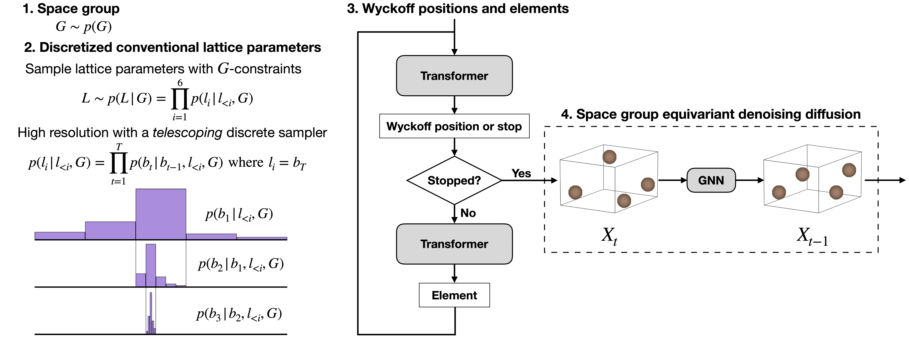

# SGEquiDiff

[Space Group Equivariant Crystal Diffusion](https://arxiv.org/abs/2505.10994)

## Abstract

Crystal structures are governed by space group symmetry, which constrains the positions of atoms within the unit cell and determines the repeating patterns throughout three-dimensional space. Existing generative models for crystals often ignore these fundamental symmetry constraints, producing structures that violate crystallographic rules or fail to explore the full diversity of symmetry-distinct configurations. In this paper, we introduce SGEquiDiff, a hierarchical generative model that explicitly incorporates space group equivariance at every stage of crystal generation. Our approach sequentially samples space groups, lattice parameters subject to Bravais lattice constraints, elements and Wyckoff positions via an autoregressive transformer, and finally fractional coordinates using a score-based diffusion process on the asymmetric unit. Equivariance of the coordinate diffusion model is achieved through symmetrization: averaging inverse-transformed predictions over all space group operations. Experimental results on the MP-20 and MPTS-52 benchmarks demonstrate that SGEquiDiff generates structurally valid, diverse, and novel crystal structures while faithfully reproducing the space group and Wyckoff position distributions of the training data.


---

## Model Description

### Overview
A crystal structure in the asymmetric unit (ASU) representation is described by:
- space group index: $sg \in \{0, \ldots, 229\}$ (one of 230 crystallographic space groups)
- lattice lengths: $(a, b, c) \in \mathbb{R}^3_{>0}$, and lattice angles: $(\alpha, \beta, \gamma) \in (0°, 180°)^3$
- element indices: $E = (e_1, \ldots, e_N)$ for $N$ ASU atoms
- Wyckoff indices: $W = (w_1, \ldots, w_N)$ specifying the Wyckoff position of each ASU atom
- fractional coordinates: $F = (f_1, \ldots, f_N),\; f_i \in [0,1)^3$ within the ASU

SGEquiDiff implements a hierarchical generative model through the `SGEQuiDiff`, which orchestrates four specialized modules: `SpaceGroupSampler`, `TelescopingDiscreteLatticeSampler`, `WyckoffElementTransformer`, and `EquivariantDiffusionModel`. The total training loss combines negative log-likelihood terms for discrete components with a score-matching loss for fractional coordinates, balanced by gradient reweighting:

$$
\mathcal{L} = w_{sg}\,\mathcal{L}_{sg} + w_{L}\,\mathcal{L}_{L} + w_{EW}\,\mathcal{L}_{EW} + w_{F}\,\mathcal{L}_{F}
$$

### Method

#### 1) Space Group Sampling
The space group is sampled from a learnable categorical distribution over all 230 space groups:

$$
p_\theta(sg) = \text{Categorical}\!\left(\text{softmax}(\boldsymbol{\theta}_{sg})\right), \quad \boldsymbol{\theta}_{sg} \in \mathbb{R}^{230}
$$

The logits $\boldsymbol{\theta}_{sg}$ are initialized to uniform values (all logits equal) and learned during training. The training loss is the negative log-likelihood:

$$
\mathcal{L}_{sg} = -\log p_\theta(sg)
$$

#### 2) Lattice Parameter Sampling
Given a space group, lattice parameters $(a, b, c, \alpha, \beta, \gamma)$ are sampled from a conditional model $p_\theta(l, \theta \mid sg)$ implemented by the `TelescopingDiscreteLatticeSampler`. Bravais lattice constraints are enforced by applying pre-computed linear transforms to the raw parameters:

$$
(a', b', c') = (a, b, c)\, T_{\text{len}}, \qquad
(\alpha', \beta', \gamma') = (\alpha, \beta, \gamma)\, T_{\text{ang}} + \delta_{\text{ang}}
$$

where $T_{\text{len}},\, T_{\text{ang}}$ are space-group-specific transform matrices and $\delta_{\text{ang}}$ are angle offsets. During training, noisy lattice parameters are generated via rejection sampling to ensure validity:

$$
\mathcal{L}_{L} = -\log p_\theta(l, \theta \mid sg)
$$

#### 3) Element and Wyckoff Position Sampling
Elements and Wyckoff positions are generated autoregressively by the `WyckoffElementTransformer`, conditioned on the space group and lattice parameters:

$$
p_\theta(E, W \mid sg, l, \theta) = \prod_{i=1}^{N} p_\theta(e_i, w_i \mid e_{<i}, w_{<i}, sg, l, \theta) \cdot p_\theta(\text{stop} \mid e_{\leq N}, w_{\leq N}, sg, l, \theta)
$$

The transformer (hidden dim 256, 4 layers, 2 attention heads) generates (element, Wyckoff) pairs until a termination token is emitted, allowing variable-length compositions. The training loss is:

$$
\mathcal{L}_{EW} = -\log p_\theta(E, W \mid sg, l, \theta)
$$

#### 4) Equivariant Fractional Coordinate Diffusion (Variance-Exploding SDE on the ASU)
Fractional coordinates are generated by a denoising diffusion process on the asymmetric unit. The forward process adds Gaussian noise with an exponential schedule:

$$
F_t = F_0 + \sigma_t \epsilon, \quad \epsilon \sim \mathcal{N}(0, I), \quad \sigma_t = \sigma_{\min}\!\left(\frac{\sigma_{\max}}{\sigma_{\min}}\right)^{t/T}
$$

The score-matching training objective is:

$$
\mathcal{L}_{F} = \mathbb{E}_{t, F_t}\!\left[\lambda_t \left\| \nabla_{F_t} \log p(F_t \mid F_0) - \hat{s}_\theta(F_t, t) \right\|^2 \right]
$$

Sampling uses a predictor-corrector scheme (reverse SDE predictor + Langevin corrector) with Wyckoff-projected Gaussian noise to keep coordinates within the ASU.

**Space Group Equivariance via Symmetrization.** The score network $\hat{s}_\theta$ achieves equivariance by symmetrizing a non-equivariant backbone $f_\theta$ over all space group operations $\{(A_g, t_g)\}_{g \in G}$:

$$
\hat{s}_\theta(x) = \frac{1}{|G|} \sum_{g \in G} A_g^{-1}\, f_\theta(A_g x + t_g)
$$

This guarantees that the predicted score transforms correctly under any symmetry operation of the space group. Wyckoff shape constraints are additionally enforced by projecting the score onto pre-computed noise projection matrices for each Wyckoff site.

#### 5) Non-Equivariant Backbone Architectures
The model supports three backbone architectures for $f_\theta$, selected via `model_type` in the configuration:

**GNN** (default): A message-passing graph neural network with periodic boundary conditions. Graphs are constructed with a cutoff radius of 10.0 Å. Node features combine element embeddings (dim 256) with Fourier time embeddings (dim 128) and optionally fractional coordinate Fourier features. Edge features combine 96-frequency plane wave Fourier features on relative fractional positions with 96-Gaussian-smeared Cartesian distances and normalized lattice parameters. Five message-passing steps with variance-preserving aggregation and graph normalization are applied, with dense skip connections.

$$
m_{ij}^{(s)} = \phi_m\!\left(h_i^{(s-1)},\, h_j^{(s-1)},\, \psi_{\mathrm{FT}}(f_j - f_i),\, \phi_{\mathrm{RBF}}(d_{ij}),\, \hat{l}\right)
$$

$$
h_i^{(s)} = h_i^{(s-1)} + \phi_h\!\left(h_i^{(s-1)},\, \sum_{j \in \mathcal{N}(i)} m_{ij}^{(s)}\right)
$$

**TorusMLP**: A simple MLP using plane wave Fourier features on fractional coordinates concatenated with time embeddings, passed through four hidden layers of width 128.

**CSPNet**: A DiffCSP-style architecture with fully-connected atom graphs and sinusoidal distance embeddings, included for comparison.

Periodic Fourier features for fractional coordinate differences $f = [f_1, f_2, f_3]^\top$:

$$
\psi_{\mathrm{FT}}(f)[c, k] =
\begin{cases}
\sin(2\pi m f_c), & k = 2m \\
\cos(2\pi m f_c), & k = 2m+1
\end{cases}
$$

which is invariant to periodic translations under wrapping.

---

## Dataset Description

- **MP-20**: 45,231 inorganic crystals from the Materials Project with at most 20 atoms per unit cell; widely used for crystal generation benchmarking.
- **MPTS-52 (Materials Project Time Split)**: 40,476 crystals with up to 52 atoms per cell; chronological split for evaluating temporal generalization.

Both datasets are pre-processed into asymmetric unit (`ASUCrystal`) objects storing space group indices, lattice parameters, element indices, Wyckoff indices, and fractional coordinates in the ASU.

Recommended data fields for each sample:
- `space_group_number`: integer in $\{1, \ldots, 230\}$
- `conventional_lattice_lengths`: $(a, b, c)$ in Ångströms, shape $(3,)$
- `conventional_lattice_angles`: $(\alpha, \beta, \gamma)$ in degrees, shape $(3,)$
- `element_indices`: 0-indexed atomic numbers for ASU atoms, shape $(N,)$
- `wyckoff_indices`: Wyckoff position indices for ASU atoms, shape $(N,)$
- `conventional_frac_coords`: fractional coordinates in $[0,1)^3$, shape $(N, 3)$

#### Dataset splits (download links)
| Dataset | Train | Val | Test | Download |
| --- | --- | --- | --- | --- |
| MP-20 | 27,136 | 9,047 | 9,046 | [mp_20.zip](https://drive.google.com/file/d/1avOCeo-OMtkKYPkDO0pz0IY36gBq8-kE/view?usp=sharing) |
| MPTS-52 | N/A | N/A | N/A | [mpts_52.zip](https://drive.google.com/file/d/1rPMi0HKMtBccAczkgg-S-kCqSS63Jy1T/view?usp=sharing) |

---

## Results

The PaddleMaterials port reproduces the full SGEquiDiff pipeline: space group sampling, Bravais-constrained lattice sampling, autoregressive (element, Wyckoff) generation, and ASU score diffusion. Numerical alignment against the reference PyTorch implementation was verified on the MP-20 checkpoint:

| Check | Result |
| --- | --- |
| forward precision (vs reference PyTorch) | 1.55e-06 |
| backward precision (vs reference PyTorch) | 4.47e-07 |
| space-group distribution JSD relative difference (PT vs PD) | 3.4% |

Evaluation metrics reported in the paper include structural validity (`struct_valid`), compositional validity (`comp_valid`), combined validity (`valid`), uniqueness rate, U.N. (unique & novel) rate, coverage recall/precision (`cov_recall` / `cov_precision`), space group marginal JSD (`jsd_space_groups`), Wyckoff dimensionality JSD (`jsd_wyckoff_dimensions`), structural and chemical fingerprint divergence, and density/element-count Wasserstein distances. The full benchmark numbers on MP-20 and MPTS-52 have not yet been reproduced end-to-end in this repository; refer to the [paper](https://arxiv.org/abs/2505.10994) for the reported values.

| Model | Dataset | Config | Checkpoint |
| --- | --- | --- | --- |
| sgequidiff | mp_20 | [sgequidiff_mp20.yaml](sgequidiff_mp20.yaml) | [sgequidiff_mp20.zip](https://paddle-org.bj.bcebos.com/paddlematerials/checkpoints/structure_generation/SGEquiDiff/sgequidiff_mp20.zip) |
| sgequidiff | mpts_52 | [sgequidiff_mpts_52.yaml](sgequidiff_mpts_52.yaml) | [sgequidiff_mpts_52.zip](https://paddle-org.bj.bcebos.com/paddlematerials/checkpoints/structure_generation/SGEquiDiff/sgequidiff_mpts_52.zip) |


---

## Command

### Training
```bash
python structure_generation/train.py -c structure_generation/configs/sgequidiff/sgequidiff_mp20.yaml
```

### Evaluation
```bash
# Point to a weight file in the model package (local cache dir after download, or a custom checkpoint)
python structure_generation/train.py -c structure_generation/configs/sgequidiff/sgequidiff_mp20.yaml Global.do_train=False Global.do_eval=True Trainer.pretrained_model_path=/path/to/checkpoints/best.pdparams
```

Note: this command reports only the validation loss. Generation-quality metrics
(`struct_valid` / `comp_valid` / `valid` / uniqueness / U.N. / coverage / JSDs)
are computed by the Generation-Quality Evaluation command below (`sample.py
--mode=compute_metric`).

### Generation
```bash
# Mode 1: use a registered pretrained model (weights downloaded automatically)
python structure_generation/sample.py --model_name='sgequidiff_mp20' --weights_name='best.pdparams' --mode='by_num_atoms' --num_atoms=8 --output_path='./sgequidiff_samples'

# Mode 2: use a local config and checkpoint
python structure_generation/sample.py --config_path=structure_generation/configs/sgequidiff/sgequidiff_mp20.yaml --checkpoint_path=/path/to/checkpoints/best.pdparams --mode=by_num_atoms --num_atoms=8 --output_path=./sgequidiff_samples
```

### Generation-Quality Evaluation
```bash
# Mode 1: use a registered pretrained model (weights downloaded automatically)
python structure_generation/sample.py --model_name='sgequidiff_mp20' --mode='compute_metric' --output_path='./sgequidiff_samples'

# Mode 2: use a local config and checkpoint
python structure_generation/sample.py --config_path=structure_generation/configs/sgequidiff/sgequidiff_mp20.yaml --checkpoint_path=/path/to/checkpoints/best.pdparams --mode=compute_metric --output_path=./sgequidiff_samples
```

---


## Citation
```
@misc{chang2025spacegroupequivariantcrystal,
      title={Space Group Equivariant Crystal Diffusion},
      author={Rees Chang and Angela Pak and Alex Guerra and Ni Zhan and Nick Richardson and Elif Ertekin and Ryan P. Adams},
      year={2025},
      eprint={2505.10994},
      archivePrefix={arXiv},
      url={https://arxiv.org/abs/2505.10994},
}
```
