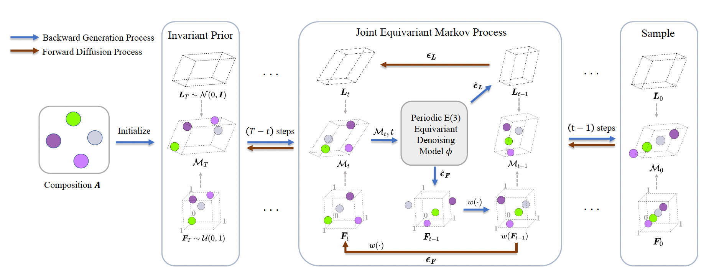
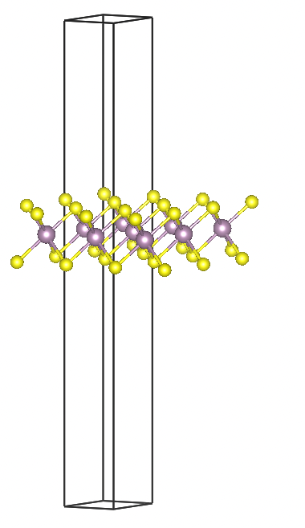
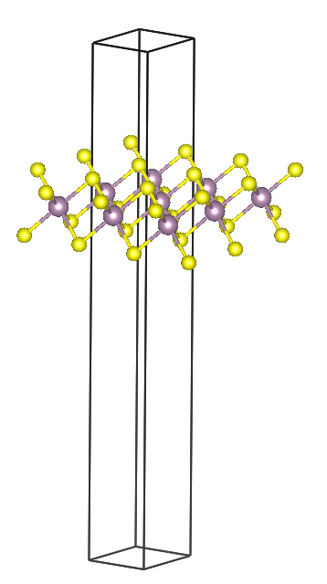
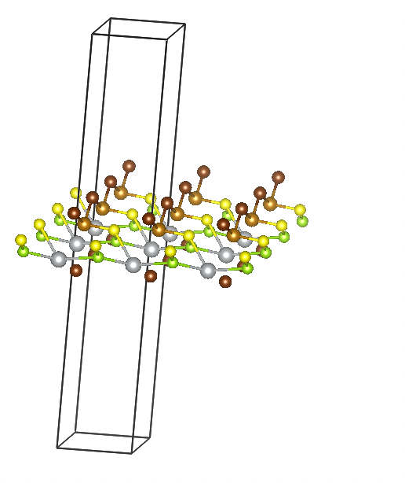
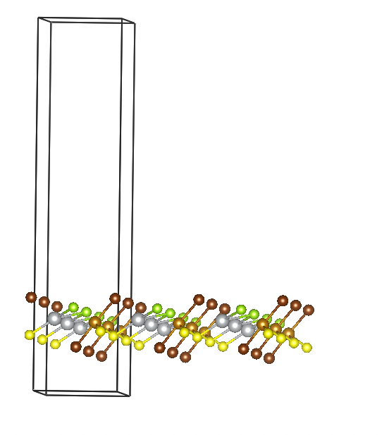
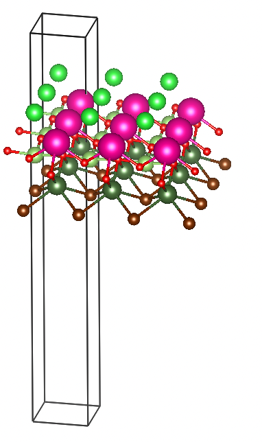
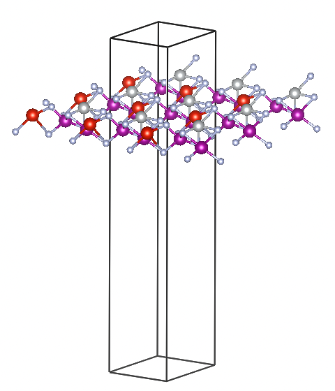

# PaddlePaddle for Materials

## 基于扩散模型的二维材料结构生成

### 整体流程（DiffCSP）

    

#### 二维材料数据

数据地址：https://365.kdocs.cn/ent/664860898/2340801472/304878020292

为保证训练数据中的结构都为稳定结构，使用ehull<0.2作为阈值进行筛选，使用筛选后的结构进行训练。

### 模型训练

    cd structure_prediction
    python main.py
    # Ab initio generation
    python main.py -c ./configs/diffcsp_2d_w_type.yaml

### 模型评估
已训练好的模型可从[此处](https://pan.baidu.com/s/1payB2J7uJE8nOSa_wVSHLw?pwd=13k6)下载。

    # 修改配置文件 configs/diffcsp_2d.yaml 里的 model/pretrained 字段为训练好的模型路径
    #   model:
    #        ...
    #        pretrained: './weights/diffcsp_2d_init/latest.pdparams'
    cd structure_predictions
    python main.py --mode=test
    python compute_metrics.py --root_path=./weights/diffcsp_2d_init/test.pt --multi_eval

### 模型推理

    # 1. 修改配置文件 configs/diffcsp_2d.yaml 里的 model/pretrained 字段为训练好的模型路径
    #   model:
    #        ...
    #        pretrained: './weights/diffcsp_2d_init/latest.pdparams'
    # 2. 修改文件 configs/diffcsp_2d.yaml 里的 dataset/sample 配置 formula 和生成数量
    #   dataset:
    #        ...
    #        sample:
    #          formula: Fe1Ag1Se1S1Br2
    #          num_evals: 20

    cd structure_prediction
    python main.py --mode=sample

    # Ab initio generation
    # 1. 修改配置文件 configs/diffcsp_2d_w_type.yaml 里的 model/pretrained 字段为训练好的模型路径
    #   model:
    #        ...
    #        pretrained: './weights/diffcsp_2d_w_type/latest.pdparams'
    # 2. 修改文件 configs/diffcsp_2d_w_type.yaml 里的 dataset/sample 配置 formula 和生成数量
    #   dataset:
    #        ...
    #        gen:
    #          total_num: 10

    cd structure_prediction
    python main.py -c configs/diffcsp_2d_w_type.yaml --mode=gen

### 实验结果
超参数详见: [diffcsp_2d.yaml](configs/diffcsp_2d.yaml)

实验结果：
    train_loss: 0.882
    val_loss: 0.961

    match_rate: 0.7879
    rms_dist: 0.1175

### 生成结果展示

* MoS2
    

        
        
    

* Fe1Ag1Se1S1Br2
    

        
        
    

#### Ab initio generation
* Rb1Er1Pa1Ga1Br1O2
    

        
    

* Mn2V1Ni1N3F3
    

        
    

